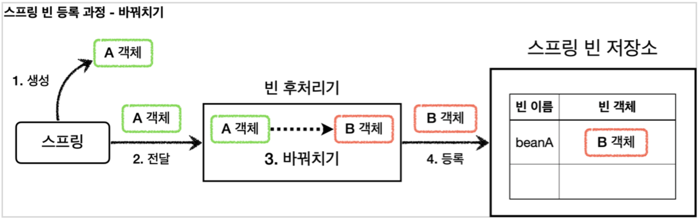

## 템플릿 메서드 패턴
### 단일 책임 원칙(SRP)
변경 지점을 하나로 모아서 변경에 쉽게 대처할 수 있는 구조를 만드는 것이다.

### 템플릿 메서드 패턴
부모 클래스의 알고리즘의 골격인 템플릿을 정의하고, 일부 변경되는 로직은 자식 클래스에 정의하는 것이다. 이렇게 하면 자식 클래스가 알고리즘의 전체 구조를 변경하지 않고, 특정 부분만 재정의할 수 있다. 결국 상속과 오버라이딩을 통한 다형성으로 문제를 해결하는 것이다.


## 프록시 패턴과 데코레이터 패턴 비교
### 의도
사실 프록시 패턴과 데코레이터 패턴은 그 모양이 거의 같고, 상황에 다라 정말 똑같을 때도 있다. 그러면 어떻게 구분하는 것일까?
디자인 패턴에서 중요한 것은 해당 패턴의 겉모양이 아니라 그 패턴을 만든 의도가 더 중요하다. 따라서 의도에 따라 패턴을 구분한다.

### 의도 비교
* 프록시 패턴의 의도 : 다른 개체에 대한 접근을 제어하기 위해 대리자를 제공
* 데코레이터 패턴의 의도 : 객체에 추가 책임(기능)을 동적으로 추가하고 기능 확장을 위한 유연한 대안 제공

## 정리
프록시를 사용하고 해당 프록시가 접근 제어가 목적이라면 프록시 패턴이고, 새로운 기능을 추가하는 것이 목적이라면 데코레이터 패턴이 된다.

## 동적 프록시 기술
### JDK 동적 프록시
- InvocationHandler를 구현

## 포인트컷, 어드바이스, 어드바이저
- 포인트컷 : 어디에 부가 기능을 적용할지, 어디에 부가 기능을 적용하지 않을지 판단하는 필터링 로직이다. 주로 클래스와 메서드 이름으로 필터링한다. 이름 그대로 어떤 포인트에 기능을 적용할지 하지 않을지 잘라서 구분하는 것이다.
- 어드바이스 : 프록시가 호출하는 부가 기능이다. 단순하게 프록시 로직이라 생각하면 된다.
- 어드바이저 : 단순하게 하나의 포인트컷과 하나의 어드바이스를 가지고 있는 것이다. 쉽게 이야기해서 포인트컷1 + 어드바이스1이다.

정리하면 부가 기능 로직을 적용해야 하는데, 포인트컷으로 어디에 적용할지 선택하고, 어드바이스로 어떤 로직을 적용할지 선택하는 것이다. 그리고 어디에 어떤 로직을 모두 알고 있는 것이 어드바이저이다.

---
조언(Advice)을 어디(Pointcut)에 할 것인가?
조언자(Advisor)는 어디(Pointcut)에 조언(Advice)을 해야할 지 알고 있다.
---

### 포인트컷
포인트컷은 크게 classFilter와 MethodMatcher 둘로 이루어진다. 이름 그대로 하나는 클래스가 맞는지, 하나는 메서드가 맞는지 확인할 때 사용한다.
둘다 true로 반환해야 어드바이스를 적용할 수 있다.

### 스프링이 제공하는 포인트컷
- NameMatchMethodPointcut : 메서드 이름을 기반으로 매칭한다. 내부에서는 PatternMatchUtils를 사용한다.
- JdkRegexpMethodPointcut : JDK 정규 표현식을 기반으로 포인트컷을 매칭한다.
- TruePointcut : 항상 참을 반환한다.
- AnnotationMatchingPointcut : 애노테이션으로 매칭한다.
- AspectJExpressionPointcut : aspectJ 표현식으로 매칭한다.

---
스프링은 AOP를 적용할 때, 최적화를 진행해서 지금처럼 프록시는 하나만 만들고, 하나의 프록시에 여러 어드바이저를 적용한다.
정리하면 하나의 target에 여러 AOP가 동시에 적용되어도, 스프링의 AOP는 target마다 하나의 프록시만 생성한다.
---

## 빈 후처리기
스프링이 빈 저장소에 등록할 목적으로 생성한 객체를 빈 저장소에 등록하기 직전에 조작하고 싶다면 빈 후처리기를 사용하면 된다.
빈 포스트 프로세서(BeanPostProcessor)는 번역하면 빈후처리기인데, 이름 그대로 빈을 생성한 후에 무언가를 처리하는 용도로 사용한다.

### 빈 후처리기 기능
빈 후처리기의 기능은 막강하다.
객체를 조작할 수도 있고, 완전히 다른 객체로 바꿔치기 하는 것도 가능하다.

### 빈 후처리기 과정


### 빈 등록 과정(빈 후처리기 포함)
1. 생성 : 스프링 빈 대상이 되는 객체를 생성
2. 전달 : 생성된 객체를 빈 저장소에 등록하기 직전에 빈 후처리기에 전달
3. 후 처리 작업 : 빈 후처리기는 전달된 스프링 빈 객체를 조작하거나 다른 객체로 바꿔치기 할 수 있다

4. 등록 : 빈 후처리기는 빈을 반환한다. 전달된 빈을 그대로 반환하면 해당 빈이 등록되고, 바꿔치기 하면 다른 객체가 빈 저장소에 등록된다.
   

## 빈 후처리기 사용 방법
### BeanPostProcessor 인터페이스
- 빈 후처리기를 사용하려면 BeanPostProcessor 인터페이스를 구현하고, 스프링 빈으로 등록하면 된다.
- postProcessBeforeInitialization : 객체 생성 이후에 @PostConstruct 같은 초기화가 발생하기 전에 호출되는 포스트 프로세서
- postProcessAfterInitialization : 객체 생성 이후에 @PostConstruct 같은 초기화가 발생한 다음에 호출되는 포스트 프로세서

### 참고 - @PostConstruct의 비밀
@PostConstruct는 스프링 빈 생성 이후에 빈을 초기화 하는 역할을 한다. 그런데 생각해보면 빈의 초기화 라는것이 단순히 @PostConstruct 애노테이션이 붙은 초기화 메서드를 한번 호출만 하면 된다.
쉽게 이야기해서 생성된 빈을 한번 조작하는 것이다.
따라서 빈을 조작하는 행위를 하는 적절한 빈 후처리기가 있으면 될 것 같다.
스프링은 CommonAnnotationBeanPostProcessor 라는 빈 후처리기를 자동으로 등록하는데, 여기에서 @PostConstruct 애노테이션이 붙은 메서드를 호출한다. 따라서 스프링 스스로도 스프링 내부의 기능을 확장하기 위해 빈 후처리기를 사용한다.

## 빈 후치리기 적용
### 빈 후처리기 - 프록시 적용


## 스프링이 제공하는 빈 후처리기1
### build.gradle 추가
```
implementation 'org.springframework.boot:spring-boot-starter-aop'
```
이 라이브러리를 추가하면 aspectjweaver라는 aspectJ관련 라이브러리를 등록하고, 스프링 부트가 AOP 관련 클래스를 자동으로 스프링 빈에 등록한다.
스프링 부트가 없던 시절에는 @EnableAspectJAutoProxy를 직접 사용해야 했는데, 이 부분을 스프링부트가 자동으로 처리해준다.
스프링 부트가 활성화하는 빈은 AopAutoConfiguration을 참고

### 자동 프록시 생성기 - AutoProxyCreator
- 앞서 이야기한 스프링 부트 자동 설정으로 AnnotationAwareAspectJAutoProxyCreator 라는 빈후처리기가 스프링 빈에 자동으로 등록된다.
- 이름 그대로 자동으로 프록시를 생성해주는 빈 후처리기이다.
- 이 빈 후처리기는 스프링 빈으로 등록된 Advisor들을 자동으로 찾아서 프록시가 필요한 곳에 자동으로 프록시를 적용해준다.
- Advisor 안에는 Pointcut과 Advice가 이미 모두 포함되어 있다. 따라서 Advisor만 알고 있으면 그 안에 있는 Pointcut으로 어떤 스프링 빈에 프록시를 적용해야 할 지 알 수 있다. 그리고 Advice로 부가 기능을 적용하면 된다.

### 참고
AnnotationAwareAspectJAutoProxyCreator는 @Aspect와 관련된 AOP기능도 자동으로 찾아서 처리해준다
Advisor는 물론이고 @Aspect도 자동으로 인식해서 프록시를 만들고 AOP를 적용해준다

## 자동 프록시 생성기의 작동 과정

1. 생성 : 스프링이 스프링 빈 대상이 되는 객체를 생성
2. 전달 : 생성된 객체를 빈 저장소에 등록하기 전에 빈 후처리기에 전달
3. 모든 Advisor 빈 조회 : 자동 프록시 생성기 - 빈 후처리기는 스프링 컨테이너에서 모든 Advisor를 조회
4. 프록시 적용 대상 체크 : 앞서 조회한 Advisor에 포함되어 있는 포인트컷을 사용해서 해당 객체가 프록시를 적용할 대상인지 아닌지 판단
5. 프록시 생성 : 프록시 적용 대상이면 프록시를 생성하고 반환해서 프록시를 스프링 빈으로 등록
6. 빈 등록 : 반환된 객체는 스프링 빈으로 등록

### 생성된 프록시


### 중요 : 포인트컷은 2가지에 사용
1. 프록시 적용 여부 판단 - 생성 단계
- 자동 프록시 생성기는 포인트컷을 사용해서 해당 빈이 프록시를 생성할 필요가 있는지 체크
- 클래스 + 메서드 조건을 모두 비교한다. 이때 모든 메서드를 체크하는데, 포인트컷 조건에 하나하나 매칭해본다. 만약 조건에 맞는 것이 하나라도 있으면 프록시를 생성
- 만약 조건에 맞는 것이 하나도 없으면 프록시를 생성할 필요가 없으므로 프록시를 생성하지 않는다.
2. 어드바이스 적용 여부 판단 - 사용 단계
- 프록시가 호출되었을 때 부가 기능인 어드바이스를 적용할지 말지 포인트컷을 보고 판단한다.

## @Aspect 프록시 - 적용
스프링은 @Aspect 애노테이션으로 매우 편리하게 포인트컷과 어드바이스로 구성되어 있는 어드바이저 생성 기능을 지원한다.

### 참고
@Aspect는 관점 지향 프로그래밍(AOP)을 가능하게 하는 AspectJ 프로젝트에서 제공하는 애노테이션이다.
스프링은 이것을 차용해서 프록시를 통한 AOP를 가능하게 한다

- @Aspect : 애노테이션 기반 프록시를 적용할 때 필요하다.
- @Around("execution(* hello.proxy.app..*(..))")
   - @Around 의 값에 포인트컷 표현식을 넣는다. 표현식은 AspectJ 표현식을 사용한다.
   - @Around 의 메서드는 어드바이스( Advice )가 된다.
- ProceedingJoinPoint joinPoint : 어드바이스에서 살펴본 MethodInvocation invocation 과 유사한 기능이다. 내부에 실제 호출 대상, 전달 인자, 그리고 어떤 객체와 어떤 메서드가 호출되었는지 정보가 포함되어 있다.
- joinPoint.proceed() : 실제 호출 대상( target )을 호출한다.

### 자동 프록시 생성기는 2가지 일을 한다
1. @Aspect를 보고 어드바이저(Advisor)로 변환해서 저장한다
2. 어드바이저를 기반으로 프록시를 생성한다

### @Aspect를 어드바이저로 젼환해서 저장하는 과정

1. 실행 : 스프링 애플리케이션 로딩 시점에 자동 프록시 생성기를 호출
2. 모든 @Aspect 빈 조회 : 자동 프록시 생성기는 스프링 컨테이너에서 @Aspect 애노테이션이 붙은 스프링 빈을 모두 조회
3. 어드바이저 생성 : @Aspect 어드바이져 빌더를 통해 @Aspect 애노테이션 정보를 기반으로 어드바이저를 생성
4. @Aspect 기반 어드바이저 저장 : 생성한 어드바이저를 @Aspect 어드바이저 빌더 내부에 저장한다.

### @Adpect 어드바이저 빌더
BeanFactoryAspectJAdvisorsBuilder 클래스이다. @Aspect의 정보를 기반으로 포인트컷, 어드바이스, 어드바이저를 생성하고 보관하는 것을 담당한다.
@Aspect의 정보를 기반으로 어드바이저를 만들고, @Aspect 어드바이저 빌더 내부 저장소에 캐시한다
캐시에 어드바이저가 이미 만들어져 있는 경우 캐시에 저장된 어드바이저를 반환한다.

### 어드바이저를 기반으로 프록시 생성


### 자동 프록시 생성기의 작동 과정
1. 생성: 스프링 빈 대상이 되는 객체를 생성한다. ( @Bean , 컴포넌트 스캔 모두 포함)
2. 전달: 생성된 객체를 빈 저장소에 등록하기 직전에 빈 후처리기에 전달한다.
3-1. Advisor 빈 조회: 스프링 컨테이너에서 Advisor 빈을 모두 조회한다.
3-2. @Aspect Advisor 조회: @Aspect 어드바이저 빌더 내부에 저장된 Advisor 를 모두 조회한다.
4. 프록시 적용 대상 체크: 앞서 3-1, 3-2에서 조회한 Advisor 에 포함되어 있는 포인트컷을 사용해서 해당 객체가 프록시를 적용할 대상인지 아닌지 판단한다. 이때 객체의 클래스 정보는 물론이고, 해당 객체의 모든 메서드를 포인트컷에 하나하나 모두 매칭해본다. 그래서 조건이 하나라도 만족하면 프록시 적용 대상이 된다. 예를 들어서 메서드 하나만 포인트컷 조건에 만족해도 프록시 적용 대상이 된다.
5. 프록시 생성: 프록시 적용 대상이면 프록시를 생성하고 프록시를 반환한다. 그래서 프록시를 스프링 빈으로 등록한다. 만약 프록시 적용 대상이 아니라면 원본 객체를 반환해서 원본 객체를 스프링 빈으로 등록한다.
6. 빈 등록: 반환된 객체는 스프링 빈으로 등록된다.

## AOP 소개 - 애스팩트
핵심 기능과 부가 기능을 분리
에스팩트는 우리말로 해석하면 관점이라는 뜻인데, 이름 그대로 애플리케이션을 바라보는 관점을 하나하나의 기능에서 횡단 관심사(cross-cutting concerns) 관점으로 달리 보는 것이다.ㅇ
이렇게 에스팩트를 사용한 프로그래밍 방식을 관점 지향 프로그래밍 AOP(Aspect-Oriented Programming) 이라 한다.

### AspectJ 프레임워크
AOP의 대표적인 구현으로 AspectJ 프레임워크가 있다. 물론 스프링도 AOP를 지원하지만 대부분 AspectJ의 문법을차용하고, AspectJ가 제공하는 기능의 일부만 제공합ㄴ다.

### AOP를 사용할 때 부가 기능 로직이 실제 로직에 추가되는 방법
#### 컴파일 시점
- .java 소스 코드를 컴파일러를 사용해서 .class를 만드는 시점에 부가 기능 로직을 추가
- AspectJ가 제공하는 특별한 컴파일러를 사용해야 한다.
- 원본 로직에 부가 기능이 추가되는 것을 위빙(Weaving)이라 한다.
#### 클래스 로딩 시점
- 로드 타임 위빙은 자바를 실행할 때 특별한 옵션(java -javaagent)을 통해 클래스 로더 조작기를 지정해야 하는데, 이 부분이 번거롭고 운영하기 어렵다.
#### 런타임 시점
- 지금까지 우리가 학습 한 프록시 방식의 AOP

### AOP 적용 위치
AOP는 지금까지 학습한 메서드 실행 위치 뿐만 아니라 다음과 같은 다양한 위치에 적용할 수 있다.
- 적용 가능 지점(조인 포인트): 생성자, 필드 값 접근, static 메서드 접근, 메서드 실행
   - 이렇게 AOP를 적용할 수 있는 지점을 조인 포인트(Join point)라 한다.
- AspectJ를 사용해서 컴파일 시점과 클래스 로딩 시점에 적용하는 AOP는 바이트코드를 실제 조작하기 때문에 해당 기능을 모든 지점에 다 적용할 수 있다.
-  프록시 방식을 사용하는 스프링 AOP는 메서드 실행 지점에만 AOP를 적용할 수 있다.
   - 프록시는 메서드 오버라이딩 개념으로 동작한다. 따라서 생성자나 static 메서드, 필드 값 접근에는 프록시 개념이 적용될 수 없다.
   - 프록시를 사용하는 스프링 AOP의 조인 포인트는 메서드 실행으로 제한된다.
- 프록시 방식을 사용하는 스프링 AOP는 스프링 컨테이너가 관리할 수 있는 스프링 빈에만 AOP를 적용할 수 있다.

### AspectJ를 사용하지 않고 스프링 AOP를 사용하는 이유
스프링이 제공하는 AOP는 프록시를 사용한다. 따라서 프록시를 통해 메서드를 실행하는 시점에만 AOP가 적용된다.
AspectJ를 사용하면 앞서 설명한 것 처럼 더 복잡하고 더 다양한 기능을 사용할 수 있다.
하지만 AspectJ를 사용하려면 공부할 내용도 많고, 자바 관련 설정(특별한 컴파일러, AspectJ 전용 문법, 자바 실행 옵션)도 복잡하다.
반면에 스프링 AOP는 별도의 추가 자바 설정 없이 스프링만 있으면 편리하게 AOP 를 사용할 수 있다.
실무에서는 스프링이 제공하는 AOP 기능만 사용해도 대부문의 문제를 해결할 수 있다.

### AOP 용어 정리
#### 조인 포인트(Join point)
- 어드바이스가 적용될 수 있는 위치, 메소드 실행, 생성자 호출, 필드 값 접근, static 메서드 접근 같은 프로그램 실행 중 지점
- 조인 포인트는 추상적인 개념이다. AOP를 적용할 수 있는 모든 지점이라 생각하면 된다.
- 스프링 AOP는 프록시 방식을 사용하므로 조인 포인트는 항상 메소드 실행 지점으로 제한된다.
#### 포인트컷(Pointcut)
- 조인 포인트 중에서 어드바이스가 적용될 위치를 선별하는 기능
- 주로 AspectJ 표현식을 사용해서 지정
- 프록시를 사용하는 스프링 AOP는 메서드 실행 지점만 포인트컷으로 선별 가능
#### 타켓(Target)
- 어드바이스를 받는 객체, 포인트컷으로 결정
#### 어드바이스(Advice)
- 부가 기능
- 특정 조인 포인트에서 Aspect에 의해 취해지는 조치
- Around(주변), Before(전), After(후)와 같은 다양한 종류의 어드바이스가 있음
#### 애스펙트(Aspect)
- 어드바이스 + 포인트컷을 모듈화 한 것
- @Aspect 를 생각하면 됨
- 여러 어드바이스와 포인트 컷이 함께 존재
#### 어드바이저(Advisor)
- 하나의 어드바이스와 하나의 포인트 컷으로 구성
- 스프링 AOP에서만 사용되는 특별한 용어
#### 위빙(Weaving)
- 포인트컷으로 결정한 타켓의 조인 포인트에 어드바이스를 적용하는 것
- 위빙을 통해 핵심 기능 코드에 영향을 주지 않고 부가 기능을 추가 할 수 있음
- AOP 적용을 위해 애스펙트를 객체에 연결한 상태
   - 컴파일 타임(AspectJ compiler)
   - 로드 타임
   - 런타임, 스프링 AOP는 런타임, 프록시 방식
#### AOP 프록시
- AOP 기능을 구현하기 위해 만든 프록시 객체, 스프링에서 AOP 프록시는 JDK 동적 프록시 또는 CGLIB 프록시이다.

## 스프링 AOP 구현
### 참고
@Aspect를 사용하려먼 @EnableAspectJAutoProxy를 스프링 설정에 추가해야 하지만, 스프링 부트를 사용하면 자동으로 추가된다.

### 어드바이스 종류
- @Around : 메서드 호출 전후에 수행, 가장 강력한 어드바이스, 조인 포인트 실행 여부 선택, 반환 값 변환, 예외 변환 등이 가능
- @Before : 조인 포인트 실행 이전에 실행
- @AfterReturning : 조인 포인트가 정상 완료후 실행
- @AfterThrowing : 메서드가 예외를 던지는 경우 실행
- @After : 조인 포인트가 정상 또는 예외에 관계없이 실행(finally)

### JoinPoint 사용
모든 어드바이스는 org.aspectj.lang.JoinPoint를 첫번째 파라미터에 사용할 수 있다.(생략 가능)
단, @Around는 PreceedingJoinPoint를 사용해야 한다
참고로 ProceedingJoinPoint는 org.aspectj.lang.JointPoint의 하위 타입이다.

### JoinPoint 인터페이스의 주요 기능
- getArgs() : 메서드 인수를 반환한다.
- getThis() : 프록시 객체를 반환한다.
- getTarget() : 대상 객체를 반환한다.
- getSignature() : 조인되는 메서드에 대한 설명을 반환한다.
- toString() : 조인되는 방법에 대한 유용한 설명을 출력

### ProceedingJoinPoint 인터페이스의 주요 기능
- proceed() : 다음 어드바이스나 타겟을 호출한다.

## 스프링 AOP - 포인트컷
### 포인트컷 표현식
AspectJ pointcut expression 즉 에스팩트J가 제공하는 포인트컷 표현식을 줄여서 말하는 것
### 포인트컷 지시자
포인트컷 표현식은 execution같은 포인트컷 지시자(Pointcut Designator)로 시작한다.

### 포인트컷 지시자의 종류
- execution : 메소드 실행 조인 포인트를 매칭한다. 스프링 AOP에서 가장 많이 사용하고, 기능도 복잡하다.
- within : 특정 타입 내의 조인 포인트를 매칭한다.
- args : 인자가 주어진 타입의 인스턴스인 조인 포인트
- this : 스프링 빈 객체(스프링 AOP 프록시)를 대상으로 하는 조인 포인트
- target : Target 객체(스프링 AOP 프록시가 가르키는 실제 대상)를 대상으로 하는 조인 포인트
- @target : 실행 객체의 클래스에 주어진 타입의 애노테이션이 있는 조인 포인트
- @within : 주어진 애노테이션이 있는 타입 내 조인 포인트
- @annotation : 메서드가 주어진 애노테이션을 가지고 있는 조인 포인트를 매칭
- @args : 전달된 실제 인수의 런타임 타입이 주어진 타입의 애노테이션을 갖는 조인 포인트
- bean : 스프링 전용 포인트컷 지시자, 빈의 이름으로 포인트컷을 지정한다.
