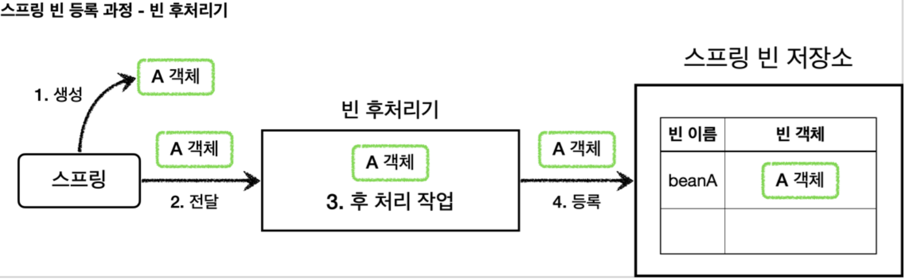
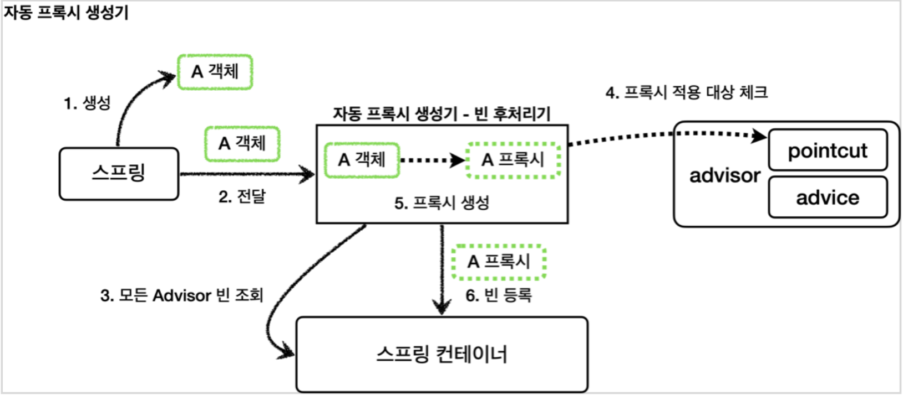
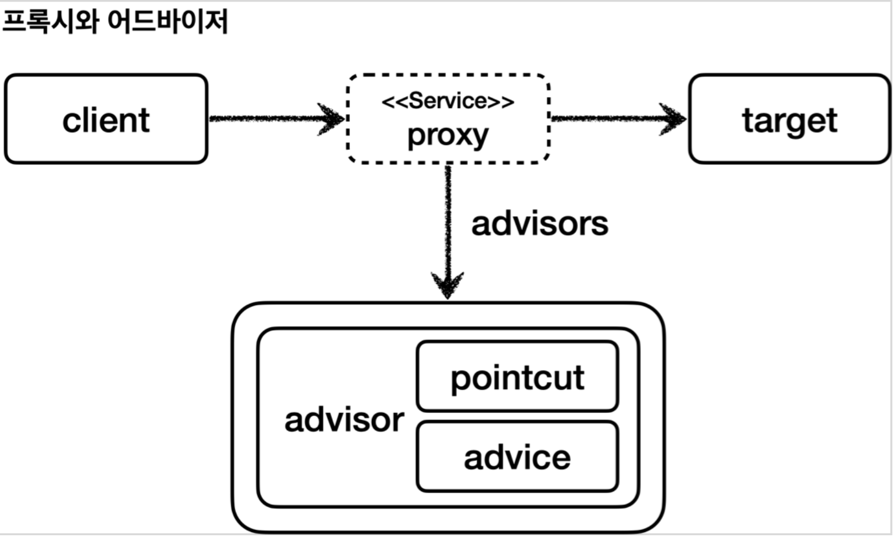
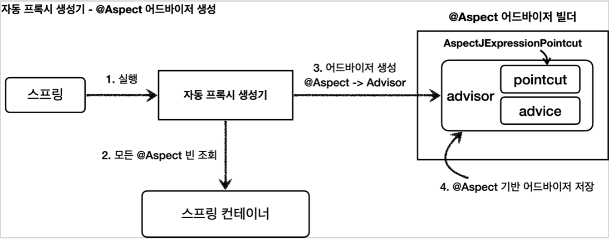

## 프록시 패턴
### 스프링 컨트롤러
- @RequestMapping : 스프링MVC는 @Controller 또는 @RequestMapping 애노테이션 타입이 있어야 스프링 컨트롤러로 인식한다. 그리고 스프링 컨트롤러로 인식해야 HTTP URL이 매핑되고 동작한다. 이 애노테이션은 인터페이스에 사용해도 된다.
- @RequestBody : HTTP 메시지 컨버터를 사용해서 응답한다. 이 애노테이션은 인터페이스에 사용해도 된다.
- @Import(AppConfig.class) : 클래스를 스프링 빈으로 등록한다. 일반적으로 @Configuration 같은 설정 파일을 등록할 때 사용하지만 스프링 빈을 등록할 때도 사용할 수 있다. 

### 프록시의 주요 기능
- 접근 제어
  - 권한에 따른 접근 차단
  - 캐싱
  - 지연 로딩
- 부가 기능 추가
  - 원래 서버가 제공하는 기능에 더해서 부가 기능을 수행한다

### GOF 디자인 패턴
둘다 프록시를 사용하는 방법이지만 GOF 디자인 패턴에서는 이 둘을 의도(intent)에 따라서 프록시 패턴과 데코레이터 패턴으로 구분한다.
- 프록시 패턴 : 접근 제어가 목적
- 데코레이터 패턴 : 새로운 기능 추가가 목적
둘다 프록시를 사용하지만, 의도가 다르다는 점이 핵심이다. 용어가 프록시 패턴이라고 해서 이 패턴만 프록시를 사용하는 것은 아니다. 데코레이터 패턴도 프록시를 사용한다.

### 프록시 패턴과 데코레이터 패턴
의도(Intent)
사실 프록시 패턴과 데코레이터 패턴은 그 모양이 거의 같고, 상황에 따라 정말 똑같을 때도 있다. 그러면 둘을 어떻게 구분하는 것일까?
디자인 패턴에서 중요한 것은 해당 패턴의 겉모양이 아니라 그 패턴을 만든 의도가 더 중요하다. 따라서 의도에 따라 패턴을 구분한다

- 프록시 패턴의 의도 : 다른 개체에 대한 접근을 제어하기 위해 대리자를 제공
- 데코레이터 패턴의 의도 : 객체에 추가 책임(기능)을 동적으로 추가하고, 기능 확장을 위한 유연한 대안 제공

> 정리
> 프록시를 사용하고 해당 프록시가 접근 제어가 목적이라면 프록시 패턴이고, 새로운 기능을 추가하는 것이 목적이라면 데코레이터 패턴이 된다.

### 인터페이스 기반 프록시와 클래스 기반 프록시
#### 프록시
프록시를 사용한 덕분에 원본 코드를 전혀 변경하지 않고, V1, V2 애플리케이션에 LogTrace 기능을 적용할 수 있었다

#### 인터페이스 기반 프록시 VS 클래스 기반 프록시
- 인터페이스가 없어도 클래스 기반으로 프록시를 생성할 수 있다
- 클래스 기반 프록시는 해당 클래스에만 적용할 수 있다. 인터페이스 기반 프록시는 인터페이스만 같으면 모든 곳에 적용할 수 있다
- 클래스 기반 프록시는 상속을 사용하기 때문에 몇가지 제약이 있다
  - 부모 클래스의 생성자를 호출해야 한다
  - 클래스에 final 키워드가 붙으면 상속이 불가능하다
  - 메서드에 final 키워드가 붙으면 해당 메서드를 오버라이딩 할 수 없다

## 동적 프록시 기술
### 리플렉션
### JDK 동적 프록시
```java
class ReflectionTest {
  @Test
  void reflection1() throws Exception {
    //클래스 정보
    Class<?> classHello = Class.forName("hello.proxy.jdkdynamic.ReflectionTest$Hello");

    Hello target = new Hello();
    //callA 메서드 정보
    Method methodCallA = classHello.getMethod("callA");
    Object result1 = methodCallA.invoke(target);
    log.info("result1={}", result1);

    //callB 메서드 정보
    Method methodCallB = classHello.getMethod("callB");
    Object result2 = methodCallB.invoke(target);
    log.info("result1={}", result2);
  }

  private void dynamicCall(Method method, Object target) throws Exception {
    log.info("dynamicCall start");
    Object result = method.invoke(target);
    log.info("result={}", result);
  }
}
```
- Class.forName("hello.proxy.jdkdynamic.ReflectionTest$Hello") : 클래스 메타정보를 획득한. 참고로 내부 클래스는 구분을 위해 $를 사용한다
- classHello.getMethod("callA") : 해당 클래스의 call 메서드 메타정보를 획득한다
- methodCallA.invoke(target) : 획득한 메서드 메타정보로 실제 인스턴스의 메서드를 호출한다. 여기서 methodCallA는 Hello 클래스의 callA()이라는 메서드 메타정보이다. methodCallA.invoke(인스턴스)를 호출하면서 인스턴스를 넘겨주면 해당 인스턴스의 callA() 메서드를 찾아서 실행한다. 여기서는 target의 callA()메서드를 호출한다.
- dynamicCall(Method method, Object target) : 공통 로직을 한번에 처리할 수 있는 통합된 공통 처리 로직

```java
public class TimeInvocationHandler implements InvocationHandler {

    private final Object target;

    public TimeInvocationHandler(Object target) {
        this.target = target;
    }

    @Override
    public Object invoke(Object proxy, Method method, Object[] args) throws Throwable {
        log.info("TimeProxy 실행");
        long startTime = System.currentTimeMillis();

        Object result = method.invoke(target, args);

        long endTime = System.currentTimeMillis();
        long resultTime = endTime - startTime;
        log.info("TimeProxy 종료 resultTime={}", resultTime);
        return result;
    }
}
```
- TimeInvocationHandler 은 InvocationHandler 인터페이스를 구현한다. 이렇게 해서 JDK 동적 프록시에 적용할 공통 로직을 개발할 수 있다
- Object target : 동적 프록시가 호출할 대상
- method.invode(target, args) : 리플렉션을 사용해서 target 인스턴스의 메서드를 실행한다. args는 메서드 호출시 넘겨줄 인수이다.

```java
public class JdkDynamicProxyTest {

    @Test
    void dynamicA() {
        AInterface target = new AImpl();
        TimeInvocationHandler handler = new TimeInvocationHandler(target);

        AInterface proxy = (AInterface) Proxy.newProxyInstance(AInterface.class.getClassLoader(), new Class[]{AInterface.class}, handler);
        proxy.call();
        log.info("targetClass={}", target.getClass());
        log.info("proxyClass={}", proxy.getClass());
    }
}
```
- new TimeInvocationHandler(target) : 동적 프록시에 적용할 핸들러 로직이다.
- Proxy.newProxyInstance(AInterface.class.getClassLoader(), new Class[]{AInterface.class}, handler)
  - 동적 프록시는 java.lang.reflect.Proxy를 통해서 생성할 수 있다
  - 클래스 로더 정보, 인터페이스, 그리고 핸들러 로직을 넣어주면 된다. 그러면 해당 인터페이스를 기반으로 동적 프록시를 생성하고 그 결과를 반환한다

### CGLIB : Code Generator Library
- CGLIB는 바이트코드를 조작해서 동적으로 클래스를 생성하는 기술을 제공하는 라이브러리이다.
- CGLIB를 사용하면 인터페이스가 없어도 구체 클래스만 가지고 동적 프록시를 만들어낼 수 있다
- CGLIB는 원래는 외부 라이브러리인데, 스프링 프레임워크가 스프링 내부 소스 코드에 포함했다. 따라서 스프링을 사용한다면 별도의 외부 라이브러리를 추가하지 않아도 사용할 수 있다.

우리가 CGLIB를 직접 사용하는 경우는 거의 없다. 스프링의 ProxyFactory가 이 기술을 편리하게 사용할 수 있게 해준

#### CGLIB 코드
JDK 동적 프록시에서 실행 로직을 위해 InvocationHandler를 제공했듯이, CGLIB는 MethodInterceptor를 제공한다
```java
public interface MethodInterceptor extends Callback {
  Object intercept(Object var1, Method var2, Object[] var3, MethodProxy var4) throws Throwable;
}
```
- obj : CGLIB가 적용된 객체
- method : 호출된 메서드
- args : 메서드를 호출하면서 전달된 인수
- proxy : 메서드 호출에 사용

```java
public class CglibTest {

    @Test
    void cglib() {
        ConcreteService target = new ConcreteService();

        Enhancer enhancer = new Enhancer();
        enhancer.setSuperclass(ConcreteService.class);
        enhancer.setCallback(new TimeMethodInterceptor(target));
        ConcreteService proxy = (ConcreteService) enhancer.create();
        proxy.call();
    }
}
```
- Enhancer : CGLIB는 Enhancer를 사용해서 프록시를 생성한다
- enhancer.setSuperclass(ConcreteService.class) :  : CGLIB는 구체 클래스를 상속 받아서 프록시를 생성할 수 있다. 어떤 구체 클래스를 상속 받을지 지정한다
- enhancer.setCallback(new TimeMethodInterceptor(target)) : 프록시에 적용할 실행 로직을 할당한다
- enhancer.create() : 프록시를 생성한다. 앞서 설정한 enhancer.setSuperclass(ConcreteService.class) 에서 지정한 클래스를 상속 받아서 프록시가 만들어진다 

JDK 동적 프록시는 인터페이스를 구현(implement)해서 프록시를 만든다. CGLIB는 구체 클래스를 상속(extends)해서 프록시를 만든다.

## 프록시 팩토리
### 인터페이스가 있는 경우에는 JDK 동적 프록시를 적용하고, 그렇지 않은 경우에는 CGLIB를 적용하려면
- 스프링은 동적프록시를 통합해서 편리하게 만들어주는 프록시 팩토리(ProxyFactory)라는 기능을 제공한다
- 프록시 팩토리는 인터페이스가 있으면 JDK 동적 프록시를 사용하고, 구체 클래스만 있다면 CGLIB를 사용한다. 그리고 이 설정을 변경할 수도 있다.

### JDK 동적 프록시가 제공하는 InovocationHandler와 CGLIB가 제공하는 MethodInterceptor를 중복으로 만들어야 되는 문제
- 스프링은 부가 기능을 적용할 때 Advice라는 새로운 개념을 도입했다. 개발자는 InvocationHandler나 MethodInterceptor를 신경쓰지 않고 Advice만 만들면 된다
- 결과적으로 InvocationHandler나 MethodInterceptor는 Advice를 호출하게 된다.


### 프록시 팩토리의 기술 선택 방법
- 대상에 인터페이스가 있으면 : JDK 동적 프록시, 인터페이스 기반 프록시
- 대상에 인터페이스가 없으면 : CGLIB, 구체 클래스 기반 프록시
- proxyTargetClass=true : CGLIB, 구체 클래스 기반 프록시, 인터페이스 여부와 상관없음

## 포인트컷, 어드바이스, 어드바이저
- 포인트컷(Pointcut) : 어디에 부가 기능을 적용할지, 어디에 부가 기능을 적용하지 않을지 판단하는 필터링 로직이다. 주로 클래스와 메서드 이름으로 필터링 한다. 이름 그대로 어떤 포인트에 기능을 적용할지 하지 않을지 잘라서 구분하는 것
- 어드바이스(Advice) : 이전에 본 것처럼 프록시가 호출하는 부가 기능이다. 단순하게 프록시 로직이라 생각하면 된다
- 어드바이저(Advisor) : 단순하게 하나의 포인트컷과 하나의 어드바이스를 가지고 있는 것이다. 쉽게 이야기해서 포인트컷1 + 어드바이스1 이다

부가 기능 로직을 적용해야 하는데, 포인트컷으로 어디에 적용할지 선택하고 어드바이스로 어떤 로직을 적용할지 선택하는 것. 그리고 어디에 어떤 로직을 모두 알고 있는 것이 어드바이저이다

### 쉽게 기억하는 방법
- 조인(Advice)을 어디(Pointcut)에 할 것인가
- 조언자(Advisor)는 어디(Pointcut)에 조언(Advice)을 해야할지 알고 있다

### 역할과 책임
- 이렇게 구분한 것은 역할과 책임을 명확하게 분리한 것이다
- 포인트컷은 대상 여부를 확인하는 필터 역할만 담당한다
- 어드바이스는 깔끔하게 부가 기능 로직만 담당한다
- 둘을 합치면 어드바이저가 된다. 스프링의 어드바이저는 하나의 포인트컷 + 하나의 어드바이스로 구성된다

### 스프링이 제공하는 포인트컷
- NameMatchMethodPointcut : 메서드 이름을 기반으로 매칭한다. 내부에서는 PatternMatchUtils를 사용한다
- JdkRegexMethodPointcut : JDK 정규 표현식을 기반으로 포인트컷을 매칭한다
- TruePointcut : 항상 참을 반환한다
- AnnotationMatchingPointcut : 애노케이션으로 매칭한다
- AspectJExpressionPointcut : aspectJ 표현식으로 매칭한다

### 가장 중요한 것은 aspectJ 표현식
실무에서는 사용하기도 편리하고 기능도 가장 많은 aspectJ 표현식을 기반으로 사용하는 AspectJExpressionPointcut을 사용하게 된다

## 빈 후처리기(Bean PostProcessor)
스프링이 빈 저장소를 등록할 목적으로 생성한 객체를 빈 저장소에 등록하기 직전에 조작하고 싶다면 빈 후처리기를 사용하면 된다.
빈 포스트 프로세서(BeanPostProcessor)는 번역하면 빈 후처리기인데, 이름 그대로 빈을 생성한 후에 무언가를 처리하는 용도로 사용한다.

### 빈 후처리기 기능
빈 후처리기의 기능은 막강하다.
객체를 조작할 수도 있고, 완전히 다른 객체로 바꿔치기 하는 것도 가능하다


### 빈 등록 과정
1. 생성 : 스프링 빈 대상이 되는 객체를 생성한다.(@Bean, 컴포넌트 스캔 포함)
2. 전달 : 생성된 객체를 빈 저장소에 등록하기 직전에 빈 후처리기에 전달한다
3. 후 처리 작업 : 빈 후처리기는 전달된 스프링 빈 객체를 조작하거나 다른 객체로 바꿔치기 할 수 있다
4. 등록 : 빈 후처리기는 빈을 반환한다. 전달된 빈을 그대로 반환하면 해당 빈이 등록되고, 바꿔치기 하면 다른 객체가 빈 저장소에 등록된다

### BeanPostProcessor 인터페이스 - 스프링 제공
```java
public interface BeanPostProcessor {
    Object postProcessBeforeInitialization(Object bean, String beanName) throws BeansException;
    Object postProcessAfterInitialization(Object bean, String beanName) throws BeanException;
}
```
- 빈 후처리기를 사용하려면 BeanPostProcessor 인터페이스를 구현하고 스프링 빈으로 등록하면 된다
- postProcessBeforeInitialization : 객체 생성 이후에 @PostContructor 같은 초기화가 발생하기 전에 호출되는 포스트 프로세서이다
- postProcessAfterInitialization : 객체 생성 이후에 @PostContructor 같은 초기화가 발생한 다음에 호출되는 포스트 프로세서이다

### 자동 프록시 생성기 - AutoProxyCreator
- 스프링 부트 자동 설정으로 AnnotationAwareAspectJAutoProxyCreator라는 빈 후처리기가 스프링 빈에 자동으로 등록된다
- 이름 그대로 자동으로 프록시를 생성해주는 빈 후처리기이다
- 이 빈 후처리기는 스프링 빈으로 등록된 Advisor들을 자동으로 찾아서 프록시가 필요한 곳에 자동으로 프록시를 적용해준다
- Advisor 안에는 Pointcut과 Advice가 이미 모두 포함되어 있다. 따라서 Advisor만 알고 있으면 그 안에 있는 Pointcut으로 어떤 스프링 빈에 ㄷ프록시를 적용해야 할 지 알수 있다. 그리고 Advice로 부가 기능을 적용하면 된다
- 
자동 프록시 생성기의 작동 과정
1. 생성 : 스프링 빈 대상이 되는 객체를 생성
2. 전달 : 생성된 객체를 빈 저장소에 등록하기 전에 빈 후처리기에 전달
3. 모든 Advisord 빈 조회 : 자동 프록시 생성시 빈 후처리기는 스프링 컨테이너의 모든 Advisor를 조회
4. 프록시 적용 대상 체크 : 포인트컷을 사용하여 해당 객체가 프록시를 적용할 대상인지 판단. 한개의 메서드라도 포인트컷 조건에 만족하면 프록시 적용 대상
5. 프록시 생성 : 프록시 적용대상이면 프록시를 생성하고 반환하여 프록시를 스프링 빈으로 등록. 아니면 원본 객체 등록
6. 빈 등록 : 반환된 객체는 스프링 빈으로 등록

- 

### 포인트컷은 2가지에 사용
1. 생성 단계에서 프록시 적용 여부를 판단할때
- 자동 프록시 생성기는 포인트컷을 사용해서 해당 빈이 프록시를 생성할 필요가 있는지 체크
- 클래스 + 메서드 조건을 모두 비교한다. 모든 메서드를 체크하여 포인트컷 조건에 맞는것이 하나라도 있으면 프록시를 생성
2. 사용 단계에서 어드바이스 적용 여부 판단
- 프록시가 호출되었을 때 어드바이서를 적용할지 판단

## Aspect AOP
### @Aspect 프록시 설명
자동 프록시 생성기(AnnotationAwareAspectJAutoProxyCreator)는 Advisor를 자동으로 찾아와서 필요한 곳에 프록시를 생성하고 적용해준다
여기에 추가로 @Aspect를 찾아서 이것을 Advisor로 만들어준다. 그래서 이름 앞에 AnnotationAware가 붙어있다

### 자동 프록시 생성기의 2가지 하는 일
1. @Aspect를 보고 어드바이저(Advisor)로 변환해서 저장한다
2. 어드바이저를 기반으로 프록시를 생성한다

- 
### @Aspect를 어드바이저로 변환하여 저장하는 과정
1. 실행 : 스프링 애플리케이션 로딩 시점에 자동 프록시 생성기를 호출
2. 모든 @Aspect 빈 조회 : 자동 프록시 생성기는 스프링 컨테이너에서 @Aspect 애노테이션이 붙은 스프링 빈을 모두 조회
3. 어드바이저 생성 : @Aspect 어드바이저 빌더를 통해 @Aspect 애노테이션 정보를 기반으로 어드바이저를 생성
4. @Aspect 기반 어드바이저 저장 : 생성한 어드바이저를 @Aspect 어드바이저 빌더 내부에 저장

### @Aspect 어드바이저 빌더
BeanFactoryAspectJAdvisorsBuilder 클래스이다. @Aspect 정보를 기반으로 포인트컷, 어드바이스, 어드바이저를 생성하고 보관하는 것을 담당
@Aspect의 정보를 기반으로 어드바이저를 만들고, @Aspect 어드바이저 빌더 내부 저장소에 캐시한다. 캐시에 어드바이저가 이미 만들어져 있는 경우 캐시에 저장된 어드바이저를 반환한다

## 스프링 AOP
### 핵심기능과 부가기능을 분리
부가 기능과 부가 기능을 어디에 적용할지 선택하는 기능을 합해서 하나의 모듈로 만들었는데 이것이 에스팩트(aspect)이다. 에스팩트는 부가 기능과 해당 부가 기능을 어디에 적용할지 정의한 것이다
이렇게 에스팩트를 사용한 프로그래밍 방식을 관점 지향 프로그래밍 AOP(Aspect-Oriented Programming)이라 한다
참고로 AOP는 OOP를 대체하기 위한 것이 아니라 횡단 관심사를 깔끔하게 처리하기 어려운 OOP의 부족한 부분을 보조하는 목적으로 개발되었다

### AspectJ 프레임워크
AOP의 대표적인 구현으로 AspectJ 프레임워크가 있다. 물론 스프링도 AOP를 지원하지만 대부분 AspectJ의 문법을 차용하고, AspectJ가 제공하는 기능의 일부만 제공한다

### AOP 적용 방식
- 컴파일 시점 : 실제 대상 코드에 에스팩트를 통한 부가 기능 호출 코드가 포함된다. AsepectJ를 직접 사용해야 한다
- 클래스 로딩 시점 : 실제 대상 코드에 에스팩트를 통한 부가 기능 호출 코드가 포함된다. AspectJ를 직접 사용해야 한다
- 런타임 시점(프록시) : 실제 대상 코드는 그대로 유지된다. 대신에 프록시를 통해 부가 기능이 적용된다. 항상 프록시를 통해야 부가 기능을 사용할 수 있다

### AOP 용어 정리
- 조인 포인트(Join point)
  - 어드바이스가 적용될 수 있는 위치, 메소드 실행, 생성자 호출, 필드값 젒근, static 메소드 접근 같은 프로그램 실행중 지점
  - 조인 포인트는추상적인 개념이다. AOP를 적용할 수 있는 모든 지점이라 생각하면 된다
  - 스프링 AOP는 프록시 방식을 사용하므로 조인 포인트는 항상 메소드 실행 지점으로 제한된다
- 포인트컷(Pointcut)
  - 조인 포인트 중에서 어드바이스가 적용될 위치를 선별하는 기능
  - 주로 AspectJ 표현식을 사용해서 지정
  - 프록시를 사용하는 스프링 AOP는 메서드 실행 지점만 포인트컷을 선별 가능
- 타겟(Target)
  - 어드바이스를 받는 객체, 포인트컷으로 결정
- 어드바이스(Advice)
  - 부가 기능
  - 특정 조인 포인트에서 Aspect에 의해 취해지는 조치
  - Around(주변), Before(전), After(후)와 같은 다양한 종류의 어드바이스가 있음
- 에스펙스(Aspect)
  - 어드바이스 + 포인트컷을 모듈화 한 것
  - @Aspect를 생각하면 됨
  - 여러 어드바이스와 포인트 컷이 함께 존재
- 어드바이저(Advisor)
  - 하나의 어드바이스와 하나의 포인트 컷으로 구성
  - 스프링 AOP에서만 사용되는 특별한 용어
- 위빙(Weaving)
  - 포인트컷으로 결정한 타겟의 조인 포인트에 어드바이스를 적용하는 것
  - 위빙을 통해 핵심 기능 코드에 영향을 주지 않고 부가 기능을 추가할 수 있음
  - AOP 적용을 위해 에스팩트를 객체에 연결한 상태
    - 컴파일 타임(AspectJ compiler)
    - 로드 타임
    - 런타임, 스프링 AOP는 런타임, 프록시 방식
- AOP 프록시
  - AOP 기능을 구현하기 위해 만든 프록시 객체, 스프링에서 AOP 프록시는 JDK 동적 프록시 또는 CGLIB 프록시이다
