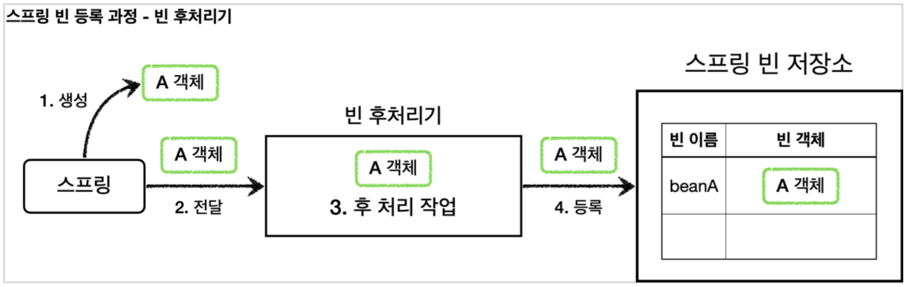
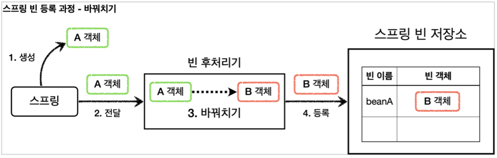

## 프록시 패턴과 데코레이터 패턴 비교
### 의도
사실 프록시 패턴과 데코레이터 패턴은 그 모양이 거의 같고, 상황에 다라 정말 똑같을 때도 있다. 그러면 어떻게 구분하는 것일까?
디자인 패턴에서 중요한 것은 해당 패턴의 겉모양이 아니라 그 패턴을 만든 의도가 더 중요하다. 따라서 의도에 따라 패턴을 구분한다.

### 의도 비교
* 프록시 패턴의 의도 : 다른 개체에 대한 접근을 제어하기 위해 대리자를 제공
* 데코레이터 패턴의 의도 : 객체에 추가 책임(기능)을 동적으로 추가하고 기능 확장을 위한 유연한 대안 제공

## 정리
프록시를 사용하고 해당 프록시가 접근 제어가 목적이라면 프록시 패턴이고, 새로운 기능을 추가하는 것이 목적이라면 데코레이터 패턴이 된다.

## 동적 프록시 기술
### JDK 동적 프록시
- InvocationHandler를 구현

## 포인트컷, 어드바이스, 어드바이저
- 포인트컷 : 어디에 부가 기능을 적용할지, 어디에 부가 기능을 적용하지 않을지 판단하는 필터링 로직이다. 주로 클래스와 메서드 이름으로 필터링한다. 이름 그대로 어떤 포인트에 기능을 적용할지 하지 않을지 잘라서 구분하는 것이다.
- 어드바이스 : 프록시가 호출하는 부가 기능이다. 단순하게 프록시 로직이라 생각하면 된다.
- 어드바이저 : 단순하게 하나의 포인트컷과 하나의 어드바이스를 가지고 있는 것이다. 쉽게 이야기해서 포인트컷1 + 어드바이스1이다.

정리하면 부가 기능 로직을 적용해야 하는데, 포인트컷으로 어디에 적용할지 선택하고, 어드바이스로 어떤 로직을 적용할지 선택하는 것이다. 그리고 어디에 어떤 로직을 모두 알고 있는 것이 어드바이저이다.

---
조언(Advice)을 어디(Pointcut)에 할 것인가?
조언자(Advisor)는 어디(Pointcut)에 조언(Advice)을 해야할 지 알고 있다.
---

### 포인트컷
포인트컷은 크게 classFilter와 MethodMatcher 둘로 이루어진다. 이름 그대로 하나는 클래스가 맞는지, 하나는 메서드가 맞는지 확인할 때 사용한다.
둘다 true로 반환해야 어드바이스를 적용할 수 있다.

### 스프링이 제공하는 포인트컷
- NameMatchMethodPointcut : 메서드 이름을 기반으로 매칭한다. 내부에서는 PatternMatchUtils를 사용한다.
- JdkRegexpMethodPointcut : JDK 정규 표현식을 기반으로 포인트컷을 매칭한다.
- TruePointcut : 항상 참을 반환한다.
- AnnotationMatchingPointcut : 애노테이션으로 매칭한다.
- AspectJExpressionPointcut : aspectJ 표현식으로 매칭한다.

---
스프링은 AOP를 적용할 때, 최적화를 진행해서 지금처럼 프록시는 하나만 만들고, 하나의 프록시에 여러 어드바이저를 적용한다.
정리하면 하나의 target에 여러 AOP가 동시에 적용되어도, 스프링의 AOP는 target마다 하나의 프록시만 생성한다.
---

## 빈 후처리기
스프링이 빈 저장소에 등록할 목적으로 생성한 객체를 빈 저장소에 등록하기 직전에 조작하고 싶다면 빈 후처리기를 사용하면 된다.
빈 포스트 프로세서(BeanPostProcessor)는 번역하면 빈후처리기인데, 이름 그대로 빈을 생성한 후에 무언가를 처리하는 용도로 사용한다.

### 빈 후처리기 기능
빈 후처리기의 기능은 막강하다.
객체를 조작할 수도 있고, 완전히 다른 객체로 바꿔치기 하는 것도 가능하다.

### 빈 후처리기 과정

### 빈 등록 과정(빈 후처리기 포함)
1. 생성 : 스프링 빈 대상이 되는 객체를 생성
2. 전달 : 생성된 객체를 빈 저장소에 등록하기 직전에 빈 후처리기에 전달
3. 후 처리 작업 : 빈 후처리기는 전달된 스프링 빈 객체를 조작하거나 다른 객체로 바꿔치기 할 수 있다

4. 등록 : 빈 후처리기는 빈을 반환한다. 전달된 빈을 그대로 반환하면 해당 빈이 등록되고, 바꿔치기 하면 다른 객체가 빈 저장소에 등록된다.
   
