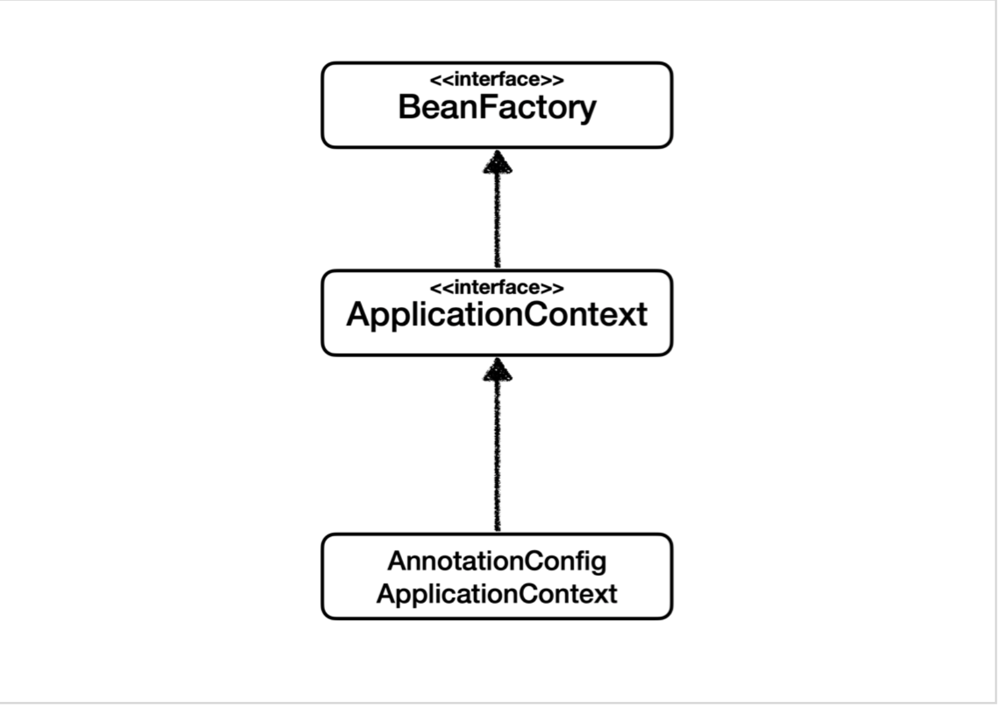
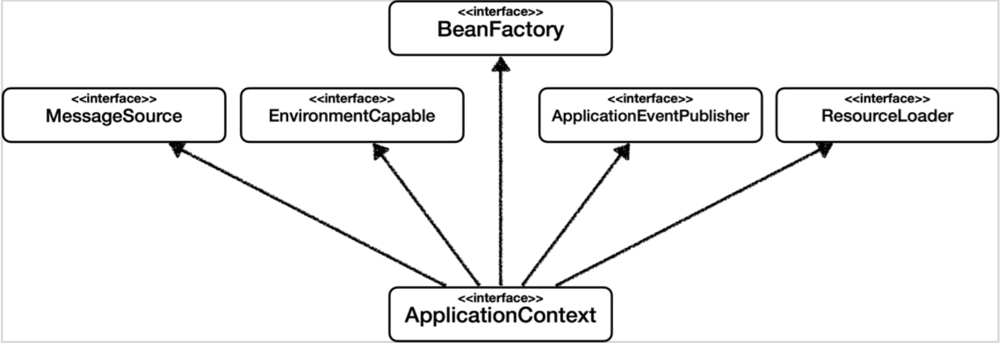
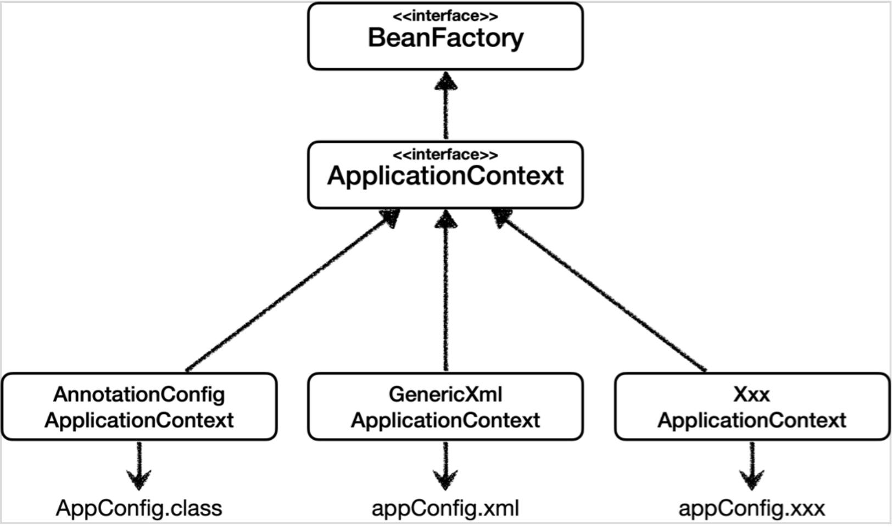

# 스프링 컨테이너와 스프링 빈
## 스프링 컨테이너 생성
- ApplicationContext를 스프링 컨테이너라고 한다
- ApplicationContext는 인터페이스다
- 스프링 컨테이너는 XML을 기반으로 만들 수 있고, 애노테이션 기반의 자바 설정 클래스로 만들 수 있다
- 직전에 AppConfig를 사용했던 방식이 애노테이션 기반의 자바 설정 클래스로 스프링 컨테이를 만든 것이다

# BeanFactory와 ApplicationContext


## BeanFactory
- 스프링 컨테이너의 최상위 인터페이스다
- 스프링 빈을 관리하고 조회하는 역할을 담당한다
- getBean()을 제공한다
- 지금까지 우리가 사용했던 대부분의 기능은 BeanFactory가 제공하는 기능이다
## ApplicationContext
- BeanFactory 기능을 모두 상속받아서 제공한다
- 빈을 관리하고 검색하는 기능을 BeanFactory가 제공해주는데, 그러면 둘의 차이가 뭘까?
- 애플리케이션을 개발할 때는 빈을 관리하고 조회하는 기능은 물론이고, 수 많은 부가 기능이 필요하다
- ApplicationContext가 제공하는 부가기능
  
- 메시지소스를 활용한 국제화 기능
  - 예를 들어서 한국에서 들어오면 한국어로, 영어권에서 들어오면 영어로 출력
- 환경변수
  - 로컬, 개발, 운영 등을 구분해서 처리
- 애플리케이션 이벤트
  - 이벤트를 발해앟고 구독하는 모델을 편리하게 지원
- 편리한 리소스 조회
  - 파일, 클래스패스, 외부 등에서리소스를 편리하게 조회

### 정리
- ApplicationContext는 BeanFactory의 기능을 상속받는다
- ApplicationContext는 빈 관리기능 + 편리한 부가 기능을 제공한다
- BeanFactory를 직접 사용할 일은 거의 없다. 부가기능이 포함된 ApplicationContext를 사용한다
- BeanFactory나 ApplicationContext를 스프링 컨테이너라고 한다

## 다양한 설정 형식 지원 - 자바 코드, XML
- 스프링 컨테이너는 다양한 형식의 설정 정보를 받아드릴 수 있게 유연하게 설계되어 있다
  - 자바 코드, XML, Groovy 등
  

## 스프링 빈 설정 메타 정보 - BeanDefinition
- BeanDefinition을 빈 설정 메타정보라고 한다
  - @Bean, <bean> 당 각각 하나씩 메타 정보가 생성된다
- 스프링 컨테이너는 이 메타정보를 기반으로 스프링 빈을 생성한다
### BeanDefinition 정보
- BeanClassName: 생성할 빈의 클래스 명(자바 설정 처럼 팩토리 역할의 빈을 사용하면 없음)
- factoryBeanName: 팩토리 역할의 빈을 사용할 경우 이름, 예) appConfig
- factoryMethodName: 빈을 생성할 팩토리 메서드 지정, 예) memberService
- Scope: 싱글톤(기본값)
- lazyInit: 스프링 컨테이너를 생성할 때 빈을 생성하는 것이 아니라, 실제 빈을 사용할 때 까지 최대한 생성을 지연처리 하는지 여부
- InitMethodName: 빈을 생성하고, 의존관계를 적용한 뒤에 호출되는 초기화 메서드 명
- DestroyMethodName: 빈의 생명주기가 끝나서 제거하기 직전에 호출되는 메서드 명
- Constructor arguments, Properties: 의존관계 주입에서 사용한다. (자바 설정 처럼 팩토리 역할 의 빈을 사용하면 없음)

# 싱글톤 컨테이너
## 싱글톤 방식의 주의점
- 싱글톤 패턴이든, 스프링 같은 싱글톤 컨테이너를 사용하든, 객체 인스턴스를 하나만 생성해서 공유하는 싱글톤 방식은 여러 클라이언트가 하나의 같은 객체 인스턴스를 공유하기 때문에 싱글톤 객체는 상태를 유지(stateful)하게 설계하면 안된다.
- 무상태(stateless)로 설계해야 한다
  - 특정 클라이언트에 의존적인 필드가 있으면 안된다
  - 특정 클라이언트가 값을 변경할 수 있는 필드가 있으면 안된다
  - 가급적 읽기만 가능해야 한다
  - 필드 대신에 자바에서 공유되지 않는 지역변수, 파라미터, ThreadLocal 등을 사용해야 한다
- 스프링 빈의 필드에 공유값을 설정하면 정말 큰 장애가 발생할 수 있다

# 의존관계 자동 주입
## 자동, 수동의 올바른 실무 운영 기준
### 수동 빈 등록을 하는 경우
어플리케이션은 크게 업무로직과 기술지원 로직으로 나눌수 있다
- 업무 로직 빈 : 웹을 지원하는 컨트롤러, 핵심 비즈니스 로직이 있는 서비스, 데이터 계층의 로직을 처리하는 리포지토리등이 모두 업무 로직이다. 보통 비즈니스 요구사항을 개발할때 추가되거나 변경된다.
- 기술 지원 빈 : 기술적인 문제나 공통 관심사(AOP)를 처리할 때 주로 사용된다. 데이터베이스 연결이나 공통 로그 처리처럼 업무로직ㅇ르 지원하기 위한 하부 기술이나 공통 기술들이다.

애플리케이션에 광범위하게 영향을 미치는 기술 지원 객체는 수동 빈으로 등록해서 설정 정보에 바로 나타나게 하는 것이 유지보수하기 좋다

# 빈 생명주기 콜백
## 빈 생명주기 콜백 시작
스프링은 크게 3가지 방법으로 빈 생명주기 콜백을 지원한다
- 인터페이스
- 설정 정보에 초기화 메서드, 종료 메서드 지정
- @PostContruct, @PreDestroy 애노테이션 지원
- @PostConstruct, @PreDestroy를 사용하자
    - 코드를 고칠수 없는 외부 라이브러리를 초기화, 종료해야 하면 @Bean의 initMethod, destroyMethod를 사용하자

# 빈 스코프
## 빈 스코프란
- 빈이 존재할 수 있는 범위
## 스프링의 스코프 지원
- 싱글톤 : 기본 스코프, 스프링 컨테이너의 시작과 종료까지 유지되는 가장 넓은 범위의 스코프이다.
- 프로토타입 : 스프링 컨테이너는 프로토타입 빈의 생성과 의존관계 주입까지만 관여하고 더는 관리하지 않는 매우 짧은 범위의 스코프이다.
### 웹 관련 스코프
- request : 웹 요청이 들어오고 나갈때까지 유지되는 스코프
- session : 웹 세션이 생성되고 종료될 때까지 유지되는 스코프
- application : 웹의 서블릿 컨텍스트와 같은 범위로 유지되는 스코프

## 프로토타입 스코프
싱글톤 스코프의 빈을 조회하면 스프링 컨테이너는 항상 같은 인스턴스의 스프링 빈을 반환한다. 반면에 프로토타입 스코프를 스프링 컨테이너에 조회하면 스프링 컨테이너는 항상 새로운 인스턴스를 생성해서 반환한다.

## 프로토타입 스코프 - 싱글톤 빈과 함께 사용시 Provider로 문제 해결
싱글톤 빈과 프로토타입 빈을 함께 사용할 때, 어떻게 하면 사용할 때 마다 항상 새로운 프로토타입 빈을 생성할 수 있을까
### 스프링 컨테이너에 요청
- 가장 간단한 방법은 싱글톤 빈이 프로토타입을 사용할 때 마다 스프링 컨테이너에 새로 요청하는 것이다.
- 의존관계를 외부에서 주입(DI)받는게 아니라 이렇게 직접 필요한 의존관계를 찾는 것을 Dependency Lookup(DL) 의존관계 조회(탐색)이라 한다.

### ObjectFactory, ObjectProvider
- 지정한 빈을 컨테이너에서 대신 찾아주는 DL 서비스를 ㅔㅈ공하는 것이 ObjectProvider이다. 참고로 과거에는 ObjectFactory가 있었는데, 여기에 편의기능을 추가해서 ObjectProvider가 만들어졌다.

### JSR-330 Provider
- javax.inject.Provider라는 JSR-330 자바 표준을 사용하는 방법. 이 방법을 사용하려면 javax.indext:javax.inject:1 라이브러리를 gradle에 추가해야 한다.

## 웹 스코프 특징
- 웹 스코프는 웹 환경에서만 동작한다.
- 웹 스코프는 프로토타입과 다르게 스프링이 일단 스코프의 종료 시점까지 관리한다. 따라서 종료 메서드가 호출된다.

### 웹 스코프 종류
- request : HTTP 요청 하나가 들어오고 나갈 때 까지 유지되는 스코프, 각각의 HTTP 요청마다 별도의 빈 인스턴스가 생성되고 관리된다
- session : HTTP Session과 동일한 생명주기를 가지는 스코프
- application : 서블릿 컨텍스트와 동일한 생명주기를 가지는 스코프
- websocket : 웹 소켓과 동일한 생명주기를 가지는 스코프

## 스코프와 프록시
```java
@Scope(value = "request", proxyMode = ScopedProxyMode.TARGET_CLASS)
public class MyLogger {
}
```
- 적용 대상이 인터페이스가 아닌 클래스일 경우 : TARGET_CLASS
- 적용 대상이 인터페이스면 INTERFACE
- 이렇게 하면 MyLogger의 가짜 프록시 클래스를 만들어두고 HTTP request와 상관 없이 가짜 프록시 클래스를 다른 빈에 미리 주입해 둘 수 있다

### CGLIB라는 라이브러리로 내 클래스를 상속 받은 가짜 프록시 객체를 만들어서 주입
- @Scope의 proxyMode = ScopedProxyMode.TARGET_CLASS를 설정하면 스프링 컨테이너는 CGLIB라는 바이트 코드를 조작하는 라이브러리를 사용해서, MyLogger를 상속받은 가짜 프록시 객체를 생성한다
- 결과를 확인해보면 xxxxCGLIB라는 클래스로 만들어진 객체가 대신 등록
- 스프링 컨테이너에 'myLogger'라는 이름으로 진짜 대시에 이 가짜 프록시 객체를 등록
- ac.getBean("myLogger", MyLogger.class)로 조회해도 프록시 객체가 조회
