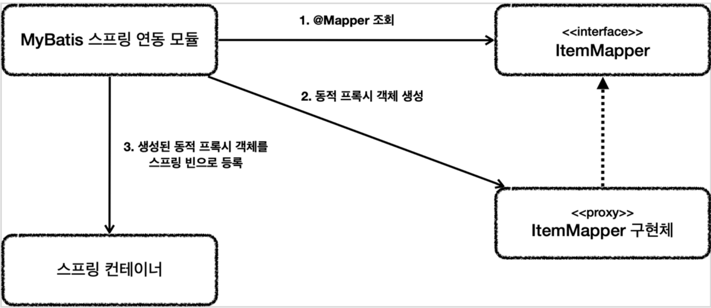

# 데이터 접근 기술 - 시작
## DTO(Data Transfer Object)
- 데이터 전송 객체
- DTO는 기능은 없고 데이터를 전달만 하는 용도로 하용되는 객체

### DTO는 어디에 두는 것이 좋을까
- DTO를 사용하는 가장 마지막 Layer에 놓는것이 좋다
- Repository나 Service에 마지막 계층에서 사용하는 쪽에 놓으면 됨

## @EventListener(ApplicationReadyEvent.class)
```java
public class TestDataInit {
    private final ItemRepository itemRepository;
    
    @EventListener(ApplicationReadyEvent.class)
    public void initData() {
        log.info("test data init");
        itemRepository.save(new Item("itemA", 10000, 10));
        itemRepository.save(new Item("itemB", 20000, 20));
    }
}
```
- 스프링 컨테이너가 완전히 초기화를 다 끝내고, 실행 준비가 되었을 때 발생하는 이벤트, 스프링이 이 시점에 해당 애노테이션이 붙은 initData() 메서드를 호출해준다
  - 참고로 이 기능 대신 @PostConstruct를 사용할 경우 AOP 같은 부분이 아직 다 처리되지 않은 시점에 호출될 수 있기 때문에 간혹 문제가 발생할 수 있다. 예를 들어서 @Transactional과 관련된 AOP가 적용되지 않은 상태로 호출될 수 있다
  - @EventListener(ApplicationReadyEvent.class)는 AOP를 포함한 스프링 컨테이너가 완전히 초기화 된 이후에 호출되기 때문에 이런 문제가 발생하지 않는다.

## 권장하는 식별자 선택 전략
데이터베이스 기본키는 다음 3가지 조건을 모두 만족해야 한다.
1. null값은 허용하지 않는다
2. 유일해야 한다
3. 변해선 안된다

테이블의 기본키를 선택하는 전략은 2가지가 있다
- 자연키(natual key)
  - 비즈니스에 의미가 있는 키
  - 예 : 주민등록번호, 이메일, 전화번호
- 대리키(surrogate key)
  - 비즈니스와 관련 없는 임의로 만들어진 키, 대체 키로도 불린다
  - 예 : 오라클 시퀀스, auto_increment, identity, 키 생성 테이블 사용

# 데이터 접근 기술 - 스프링 JdbcTemplate
## JdbcTemplate 장점
- 설정의 편리함
  - JdbcTemplate은 spring-jdbc 라이브러리에 포함되어 있는데, 이 라이브러리는 스프링으로 JDBC를 사용할 때 기본으로 사용되는 라이브러리이다. 그리고 별도의 복잡한 설정 없이 바로 사용할 수 있다
- 반복 문제 해결
  - JdbcTemplate은 템플릿 콜백 패턴을 사용해서, JDBC를 직접 사용할 때 발생하는 대부분의 반복 작업을 대신 처리해준다
  - 개발자는 SQL을 작성하고, 전달할 파라미터를 정의하고, 응답 값을 매핑하기만 하면 된다
  - 우리가 생각할 수 있는 대부분의 반복 작업을 대신 처리해준다
    - 커넥션 획득
    - statement를 준비하고 실행
    - 결과를 반복하도록 루프를 실행
    - 커넥션 종료, statement, resultset 종료
    - 트랜잭션 다루기 위한 커넥션 동기화
    - 예외 발생시 스프링 예외 변환기 실행
## JdbcTemplate의 단점
- 동적 SQL을 해결하기 어렵다

## JdbcTemplate의 설정
```xml
//JdbcTemplate 추가
implementation 'org.springframework.boot:spring-boot-starter-jdbc'

//H2 데이터베이스 추가
runtimeOnly 'com.h2database:h2'
```

### KeyHolder
- KeyHolder와 connection.prepareStatement(sql, new String[]{"id"})를 사용해서 id를 지정해주면 INSERT 쿼리 실행 이후에 데이터베이스에서 생성된 ID값을 조회할 수 있다

### template.query()
- 결과가 하나 이상일때 사용
- RowMapper는 데이터베이스의 반환 결과인 ResultSet을 객체로 변환한다
- 결과가 없으면 빈 컬렉션을 반환한다

### itemRowMapper()
- 데이터베이스의 조회 결과를 객체로 변환할 때 사용
- JDBC를 직접 사용할 때 ResultSet를 사용했던 부분
```java
public class Repository {
  private RowMapper<Item> itemRowMapper() {
    return ((rs, rowNum) -> {
      Item item = new Item();
      item.setId(rs.getLong("id"));
      item.setItemName(rs.getString("item_name"));
      item.setPrice(rs.getInt("price"));
      item.setQuantity(rs.getInt("quantity"));
      return item;
    });
  }
}
```

### JdbcTeamplate의 SQL 로그 설정
```properties
#jdbcTemplate sql log
logging.level.org.springframework.jdbc=debug
```

## NamedParameterJdbcTemplate의 설정
### 이름 지정 파라미터
- 파라미터를 전달하려면 Map처럼 key, value 데이터 구조를 만들어서 전달해야 한다. 여기서 key는 :파라미터이름 으로 지정한 파라미터의 이름이고, value는 해당 파라미터의 값이 된다

이름 지정 바인딩에서 자주 사용하는 파라미터의 종류에는 크게 3가지가 있다
- Map
- SqlParameterSource
  - MapSqlParameterSource
  - BeanPropertySqlParameterSource

1. Map
```java
Map<String, Long> param = Map.of("id", id);
Item item = template.queryForObject(sql, param, itemRowMapper());
```
2. MapSqlParameterSource
Map과 유사하지만 SQL 타입을 지정할 수 있는 등 SQL에 좀 더 특화된 기능을 제공한다
SqlParameterSource 인터페이스의 구현체이다
MapSqlParameterSource는 메서드 체인을 통한 편리한 사용법도 제공한다
```java
MapSqlParameterSource param = new MapSqlParameterSource()
                .addValue("itemName", updateParam.getItemName())
                .addValue("price", updateParam.getPrice())
                .addValue("quantity", updateParam.getQuantity())
                .addValue("id", itemId);
```

3. BeanPropertySqlParameterSource
자바빈 프로퍼티 규약을 통해 자동으로 파라미터 객체를 생성한다
```java
SqlParameterSource param = new BeanPropertySqlParameterSource(item);
KeyHolder keyHolder = new GeneratedKeyHolder();
template.update(sql, param, keyHolder);
```

### BeanPropertyRowMapper
ResultSet의 결과를 받아서 자바빈 규약에 맞추어 데이터를 변환한다
```java
private RowMapper<Item> itemRowMapper() {
return BeanPropertyRowMapper.newInstance(Item.class); // camel 변환 지원
    }
```

* 관례의 불일치
자바 객체는 카멜(camelCase) 표기법을 사용한다. itemName 처럼 중간에 낙타 봉이 올라와 있는 표기법이다.
반면에 관계형 데이터베이스에서는 주로 언더스코어를 사용하는 snake_case 표기법을 사용한다. item_name처럼 중간에 언더스코어를 사용하는 표기법이다.
이 부분을 관례로 많이 사용하다 보니 BeanPropertyRowMapper는 언더스코어 표기법을 카멜로 자동 변환해준다.

## JdbcTemplate - SimpleJdbcInsert
JdbcTemplate는 INSERT SQL을 직접 작성하지 않아도 되도록 SimpleJdbcInsert라는 편리한 기능을 제공한다
```java
public class JdbcTemplateItemRepositoryV3 implements ItemRepository {

  private final NamedParameterJdbcTemplate template;
  private final SimpleJdbcInsert jdbcInsert;

  public JdbcTemplateItemRepositoryV3(DataSource dataSource) {
    this.template = new NamedParameterJdbcTemplate(dataSource);
    this.jdbcInsert = new SimpleJdbcInsert(dataSource)
            .withTableName("item")
            .usingGeneratedKeyColumns("id");
//                .usingColumns("item_name", "price", "quantity"); // 생략 가능
  }

  @Override
  public Item save(Item item) {
    SqlParameterSource param = new BeanPropertySqlParameterSource(item);
    Number key = jdbcInsert.executeAndReturnKey(param);
    item.setId(key.longValue());
    return item;
  }
}
```
- withTableName : 데이터를 저장할 테이블 명을 지정한다
- usingGeneratedKeyColumns : key를 생성하는 PK 컬럼 명을 지정한다
- usingColumns : INSERT SQL에 사용할 컬럼을 지정한다. 특정 값만 저장하고 싶을 때 사용한다. 생략할 수 있다
- 
SimpleJdbcInsert는 생성 시점에 데이터베이스 테이블의 메타 데이터를 조회한다. 따라서 어떤 컬럼이 있는지 확인할 수 있으므로 usingColumns을 생략할 수 있다. 만약 특정 컬럼만 지정해서 저장하고 싶다면 usingcolumns를 사용하면 된다

## JdbcTemplate 기능 정리
- JdbcTemplate : 순서 기반 파라미터 바인딩을 지원한다
- namedParameterJdbcTemplate : 이름 기반 파라미터 바인딩을 지원한다(권장)
- SimpleJdbcInsert : INSERT SQL을 편리하게 사용할 수 있다
- SimpleJdbcCall : 스토어드 프로시저를 편리하게 호출할 수 있다

> 스토어드 프로시저를 사용하기 위한 SimpleJdbcCall 메뉴얼
> https://docs.spring.io/spring-framework/docs/current/reference/html/data-access.html#jdbc-simple-jdbc-call-1

> 스프링 JdbcTemplate 사용 방법 공식 메뉴얼
> https://docs.spring.io/spring-framework/docs/current/reference/html/data-access.html#jdbc-JdbcTemplate

# 데이터 접근 기술 - 테스트
## 테스트에서 중요한 원칙
- 테스트는 다른 테스트와 격리해야 한다
- 테스트는 반복해서 실행할 수 있어야 한다

## 테스트에 직접 트랜잭션 추가
```java
@Autowired
PlatformTransactionManager transactionManager;
TransactionStatus status;

@BeforeEach
void beforeEach() {
//트랜잭션 시작
    status = transactionManager.getTransaction(new DefaultTransactionDefinition());
}

@AfterEach
void afterEach() {
    //MemoryItemRepository 의 경우 제한적으로 사용
    if (itemRepository instanceof MemoryItemRepository) {
        ((MemoryItemRepository) itemRepository).clearStore();
    }
    //트랜잭션 롤백
    transactionManager.rollback(status);
}
```
- 트랜잭션 관리자는 PlatformTransactionManager를 주입 받아서 사용하면 된다.
- @BeforeEach : 각각의 테스트 케이스를 실행하기 직전에 호출된다. 따라서 여기서 트랜잭션을 시작하면 된다
- @AfterEach : 각각의 테스트 케이스가 완료된 직후에 호출된다. 따라서 여기서 트랜잭션을 롤백하면 된다

## 테스트 - @Transactional
### @Transactional 원리
스프링이 제공하는 @Transactional 애노테이션은 로직이 성공적으로 수행하면 커밋하도록 동작한다.
그런데 @Transactional 애노테이션을 테스트에서 사용하면 아주 특별하게 동작한다.
@Transactional이 테스트에 있으면 스프링은 테스트를 트랜잭션 안에서 실행하고, 테스트가 끝나면 트랜잭션을 자동으로 롤백시켜 버린다

## 테스트 - 임베디드 모드 DB
### 임베디드 모드
H2 데이터베이스는 자바로 개발되어 있고, JVM 안에서 메모리 모드로 동작하는 특별한 기능을 제공한다. 그래서 애플리케이션을 실행할 때 H2 데이터베이스도 해당 JVM 메모리에 포함해서 함께 실행할 수 있다.
DB를 애플리케이션에 내장해서 함께 실행한다고 해서 임베디드 모드(Embedded mode)라고 한다. 물론 애플리케이션이 종료되면 임베디드 모드로 동작하는 H2 데이터베이스도 함께 종료되고, 데이터도 모두 사라진다
쉽게 이야기해서 애플리케이션에서 자바 메모리를 함께 사용하는 라이브러리처럼 동작하는 것이다.
- jdbc:h2:mem:db : 데이터소스를 만들때 이렇게만 적으면 임베디드 모드(메모리 모드)로 동작하는 H2 데이터베이스를 사용할 수 있다
- DB_CLOSE_DELAY=-1 : 임베디드 모드에서는 데이터베이스 커넥션 연결이 모두 끊어지면 데이터베이스도 종료되는데, 그것을 방지하는 설정이다.
- 이 데이터소스를 사용하면 메모리 DB를 사용할 수 있다

> 테스트의 application.properties에 데이터베이스 커넥션 정보를 설정하지 않으면 스프링 부트는 임베디드 모드로 접근하는 데이터소스를 만들어서 제공한다.

### 스프링 부트 - 기본 SQL 스크립트를 사용해서 데이터베이스를 초기화하는 기능
메모리 DB는 애플리케이션이 종료될 때 함께 사라지기 때문에, 애플리케이션 실행 시점에 데이터베이스 테이블도 새로 만들어주어야 한다.
JDBC나 JdbcTemplate를 직접 사용해서 테이블을 생성하는 DDL을 호출해도 되지만 너무 불편하다. 스프링 부트는 SQL 스크립트를 실행해서 애플리케이션 로딩 시점에 데이터베이스를 초기화하는 기능을 제공한다.

## 데이터 접근 기술 - MyBatis
MyBatis는 JdbcTemplate보다 더 많은 기능을 제공하는 SQL Mapper이다.

### MyBatis 라이브러리 의존성 추가
```properties
 //MyBatis 추가
implementation 'org.mybatis.spring.boot:mybatis-spring-boot-starter:2.2.0'
```
- mybatis-spring-boot-starter : MyBatis를 스프링부트에서 편리하게 사용할 수 있게 시작하는 라이브러리
- mybatis-spring-boot-autoconfigure : MyBatis와 스프링 부트 설정 라이브러리
- mybatis-spring : MyBatis와 스프링을 연동하는 라이브러리
- mybatis : MyBatis 라이브러리


### 스프링부트 MyBatis 프로퍼티 설정
```properties
#MyBatis
mybatis.type-aliases-package=hello.itemservice.domain
mybatis.configuration.map-underscore-to-camel-case=true
logging.level.hello.itemservice.repository.mybatis=trace
```
- mybatis.type-aliases-package
  - 마이바티스에서 타입 정보를 사용할 때는 패키지 이름을 적어주어야 하는데, 여기에 명시하면 패키지 이름을 생략할 수 있다
  - 지정한 패키지와 그 하위 패키지가 자동으로 인식된다
  - 여러 위치를 지정하려면 ,, ;로 구분하면 된다
- mybatis.configuration.map-underscore-to-camel-case
  - JdbcTemplate의 BeanPropertyRowMapper에서 처럼 언더바를 카멜로 자동 변경해주는 기능을 활성화 한다
- logging.level.hello.itemservice.repository.mybatis
  - MyBatis에서 실행되는 쿼리 로그를 확인할 수 있다

```java
@Mapper
public interface ItemMapper {
    void save(Item item);
    void update(@Param("id") Long id, @Param("updateParam") ItemUpdateDto updateParam);
    List<Item> findAll(ItemSearchCond itemSearch);
    Optional<Item> findById(Long id);
}
```
- 마이바티스 매핑 XML을 호출해주는 매퍼 인터페이스이다
- 이 인터페이스에는 @Mapper 애노테이션을 붙여주어야 한다. 그래야 MyBatis에서 인식할 수 있다
- 이 인터페이스의 메서드를 호출하면 다음에 보이는 xml의 해당 SQL을 실행하고 결과를 돌려준다

```xml
<?xml version="1.0" encoding="UTF-8"?>
<!DOCTYPE mapper PUBLIC "-//mybatis.org//DTD Mapper 3.0//EN"
        "http://mybatis.org/dtd/mybatis-3-mapper.dtd">
<mapper namespace="hello.itemservice.repository.mybatis.ItemMapper">
    <insert id="">
    </insert>
    <update id="">
    </update>
    <select id="">
    </select>
</mapper>
```
- namespace : 앞서 만든 매퍼 인터페이스를 지정하면 된다
- id에는 매퍼 인터페이스에 설정한 메서드 이름을 지정하면 된다.
- 파라미터는 #{} 문법을 사용하면 된다. 그리고 매퍼에서 넘긴 객체의 프로퍼티 이름을 적어주면 된다
- resultType은 반환타입을 명시하면 된다.
- XML 특수문자
  - XML에서는 데이터 영역에 <, > 같은 특수문자를 사용할 수 없기 때문에 아래와 같이 치환문자를 사용하거나 CDATA 구문을 사용해야 한다
```properties
< : &lt;
> : &gt;
& : &amp;
```
```xml
<if test="maxPrice != null">
    <![CDATA[
        and price <= #{maxPrice}
    ]]>
</if>
```

> XMl 파일 경로 수정하기
> mybatis.mapper-locations=classpath:mapper/**/*.xml

### MyBatis 분석

1. 애플리케이션 로딩 시점에 MyBatis 스프링 연동 모듈을 @Mapper가 붙어있는 인터페이스를 조사한다
2. 해당 인터페이스가 발견되면 동적 프록시 기술을 사용해서 ItemMapper 인터페이스의 구현체를 만든다
3. 생성된 구현체를 스프링 빈으로 등록한다

### MyBatis 기능 - 동적 SQL
- if
```xml
<select id="findActiveBlogWithTitleLike"
       resultType="Blog">
    SELECT * FROM BLOG
    WHERE state = ‘ACTIVE’
    <if test="title != null">
      AND title like #{title}
    </if>
</select>
```
- 해당 조건에 따라 값을 추가할지 말지 판단한다
- 내부의 문법은 OGNL을 사용한다

- choose(when, otherwise)
```xml
<select id="findActiveBlogLike" resultType="Blog">
    SELECT * FROM BLOG WHERE state = ‘ACTIVE’
    <choose>
      <when test="title != null">
        AND title like #{title}
      </when>
      <when test="author != null and author.name != null">
        AND author_name like #{author.name}
      </when>
      <otherwise>
        AND featured = 1
      </otherwise>
    </choose>
</select>
```
- trim, where, set
```xml
<select id="findActiveBlogLike"
       resultType="Blog">
    SELECT * FROM BLOG
    WHERE
    <if test="state != null">
      state = #{state}
    </if>
    <if test="title != null">
      AND title like #{title}
    </if>
    <if test="author != null and author.name != null">
      AND author_name like #{author.name}
    </if>
</select>
```
- 위와 같이 사용하게 되면 모든 조건을 만족하지 않을때 WHERE 또는 AND 구문이 만족할 경우 WHERE AND 이렇게 문법 오류 SQL이 만들어지게 된다

- where 사용
```xml
<select id="findActiveBlogLike" resultType="Blog">
    SELECT * FROM BLOG
    <where>
      <if test="state != null">
           state = #{state}
      </if>
      <if test="title != null">
          AND title like #{title}
      </if>
      <if test="author != null and author.name != null">
          AND author_name like #{author.name}
      </if>
    </where>
</select>
```
- <where>는 문장이 없으면 where을 추가하지 않는다. 문장이 있으면 where을 추가한다. 만약 and가 먼저 시작된다면 and를 지운다
- 참고로 trim을 사용해도 되는데, 아래와 같이 정의하면 <where>과 같은 기능을 수행한다
```xml
<trim prefix="WHERE" prefixOverrides="AND |OR ">
    ...
</trim>
```

- foreach
```xml
<select id="selectPostIn" resultType="domain.blog.Post">
    SELECT *
    FROM POST P
    <where>
      <foreach item="item" index="index" collection="list"
          open="ID in (" separator="," close=")" nullable="true">
            #{item}
      </foreach>
       </where>
</select>
```
- 컬렉션을 반복 처리할 때 사용한다. where in (1,2,3,4,5,6)와 같은 문장을 쉽게 완성할 수 있다
- 파라미터로 List를 전달하면 된다

### MyBatis 기능 - 기타 기능
#### 애노테이션으로 SQL 작성
```java
@Select("select id, item_name, price, quantity from item where id=#{id}")
Optional<Item> findById(Long id);
```
- @Insert, @Update, @Delete, @Select 기능이 제공된다
- 이 경우 XML에 해당 태그는 제거해야 한다
- 동적 SQL이 해결되지 않으므로 간단한 경우에만 사용한다

#### 재사용 가능한 SQL 조각
```xml
<sql id="userColumns"> ${alias}.id,${alias}.username,${alias}.password </sql>

<select id="selectUsers" resultType="map">
    select
    <include refid="userColumns"><property name="alias" value="t1"/></include>,
    <include refid="userColumns"><property name="alias" value="t2"/></include>
    from some_table t1
    cross join some_table t2
</select>
```
- <include>를 통해서 <sql>조각을 찾아서 사용할 수 있다

```xml
 <sql id="sometable">
    ${prefix}Table
</sql>
  <sql id="someinclude">
    from
      <include refid="${include_target}"/>
  </sql>
  <select id="select" resultType="map">
    select
      field1, field2, field3
    <include refid="someinclude">
      <property name="prefix" value="Some"/>
      <property name="include_target" value="sometable"/>
    </include>
  </select>
```
- 프로퍼티 값을 전달할 수 있고, 해당 값은 내부에서 사용할 수 있다

### ResultMap
- 결과를 매핑할때 사용할 수 있다
```xml
<resultMap id="userResultMap" type="User">
    <id property="id" column="user_id" />
    <result property="username" column="username"/>
    <result property="password" column="password"/>
  </resultMap>
  <select id="selectUsers" resultMap="userResultMap">
    select user_id, user_name, hashed_password
    from some_table
    where id = #{id}
</select>
```

## 데이터 접근 기술 - JPA
### JPA 설정
- 의존관계 추가(gradle 기준)
```xml
//JPA, 스프링 데이터 JPA 추가
implementation 'org.springframework.boot:spring-boot-starter-data-jpa'
```
- hibernate-core : JPA 구현체인 하이버네이트 라이브러리
- jakarta.persistence-api : JPA 인터페이스
- spring-data-jpa : 스프링 데이터 JPA 라이브러리

- 로그 설정 추가
```properties
logging.level.org.hibernate.SQL=DEBUG
logging.level.org.hibernate.type.descriptor.sql.BasicBinder=TRACE
```
- org.hibernate.SQL=DEBUG : 하이버네이트가 생성하고 실행하는 SQL을 확인할 수 있다
- org.hibernate.type.descriptor.sql.BasicBinder=TRACE : SQL에 바인딩되는 파라미터를 확인할 수 있다
- spring.jpa.show-sql=true : 참고로 이런 설정도 있다. 이전 설정은 logger를 통해서 SQL이 출력된다. 이 설정은 System.out 콘솔을 통해서 SQL이 출력된다. 따라서 이 설정은 권장하지는 않는다(둘다 켜면 logger, System.out 둘다 로그가 출력되어서 같은 로그가 중복해서 출력된다)
