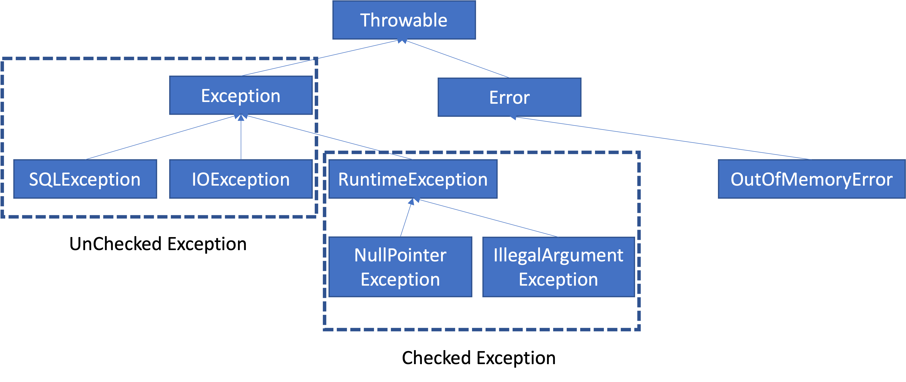

## 데이터베이스에서의 트랜잭션
- 하나의 거래를 안전하게 처리하도록 보장해주는 것

## 트랜잭션 ACID
트랜잭션은 원자성(Atomicity), 일관성(Consistency), 격리성(Isolation), 지속성(Durability)을 보장해야 한다
- 원자성 : 트랜잭션 내에서 실행한 작업들은 마치 하나의 작업인 것처럼 모두 성공하거나 모두 실패해야 함
- 일관성 : 모든 트랜잭션은 일관성 있는 데이터베이스 상태를 유지해야 한다. 예를 들어 데이터베이스에서 정한 무결성 제약 조건을 항상 만족해야 한다.
- 격리성 : 동시에 실행되는 트랜잭션들이 서로에게 영향을 미치지 않도록 격리한다. 예를 들어 동시에 같은 데이터를 수정하지 못하도록 해야 한다. 격리성은 동시성과 관련된 성능 이슈로 인해 트랜잭션 격리 수준(Isolation Level)을 선택할 수 있다.
- 지속성 : 트랜잭션을 성공적으로 끝내면 그 결과가 항상 기록되어야 한다. 중간에 시스템에 문제가 발생해도 데이터베이스 로그 등을 사용해서 성공한 트랜잭션 내용을 복구해야 한다.

## 트랜잭션 격리 수준 - Isolation level
- READ UNCOMMITED(커밋되지 않은 읽기)
- READ COMMITTED(커밋된 읽기)
- REPEATABLE READ(반복 가능한 읽기)
- SERIALIZABLE(직렬화 기능)

## 자동커밋과 수동 커밋
- 자동 커밋 : 각각의 쿼리 실행 직후에 자동으로 커밋을 호출, 때문에 원하는 트랜잭션 기능을 제대로 활용할 수 없다
- 수동 커밋 : 트랜잭션 기능을 제대로 수행하려면 수동 커밋을 사용해야 한다. 보통 자동 커밋 모드가 기본으로 설정된 경우가 많기 때문에 수동 커밋 모드로 설정하는 것을 트랜잭션을 시작한다고 표현할 수 있다.
```properties
set autocommit true(false);
```
## DB Lock
### 세션 락 타임아웃
```properties
SET LOCK_TIMEOUT <milliseconds>
```

### 조회시에 Lock을 걸고 싶을 경우
```sql
select * from member where member_id='memberA' for update;
```

### 스프링의 트랜잭션 추상화
- PlatformTransactionManager : 스프링 트랜잭션 추상화의 핵신
- 여러 트랜잭션 관리 클래스가 위 PlatformTransactionManager를 구현
  - DataSourceTransactionManager : JDBC트랜잭션 관리
  - JpaTransactionManager : JPA 트랜잭션 관리
  - HibernateTransactionManager : 하이버네이트 트랜잭션 관리

```java
public interface PlatformTransactionManager extends TransactionManager {
	TransactionStatus getTransaction(@Nullable TransactionDefinition definition) throws TransactionException;
	void commit(TransactionStatus status) throws TransactionException;
	void rollback(TransactionStatus status) throws TransactionException;
}
```
### 스프링의 트랜잭션 동기화
스프링은 쓰레드 로컬(ThreadLocal)을 사용해서 커넥션을 동기화해준다. 트랜잭션 매매니저는 내부에서 이 트랜잭션 동기화 매니저를 사용한다
1. 트랜잭션을 시작하려면 커넥션이필요하다. 트랜잭션 매니저는 데이터소스를 통해서 커넥션을 만들고 트랜잭션을 시작한다.
2. 트랜잭션 매니저는 트랜잭션이 시작된 커넥션을 트랜잭션 동기화 매니저에 보관한다.
3. 리포지토리는 트랜잭션 동기화 매니저에 보관된 커넥션을 꺼내서 사용한다. 따라서 파라미터로 커넥션을 전달하지 않아도 된다
4. 트랜잭션이 종료되면 트랜잭션 매니저는 트랜잭션 동기화 매니저에 보관된 커넥션을 통해 트랜잭션을 종료하고 커넥션을 닫는다.

#### 트랜잭션 동기화 매니저
```java
org.springframework.transaction.support.TransactionSynchronizationManager
```
- 트랜잭션 동기화를 사용하려면 DataSourceUtils를 사용해야 한다.
- DataSourceUtils.getConnection()
  - 트랜잭션 동기화 매니저가 관리하는 커넥션이 있으면 해당 커넥션을 반환
  - 트랜잭션 동기화 매니저가 관리하는 커넥션이 없는 경우 새로운 커넥션을 생성해서 반환
- DatasourceUtils.releaseConnection()
  - 트랜잭션을 사용하기 위해 동기화된 커넥션은 커넥션을 닫지 않고 그대로 유지
  - 트랜잭션 동기화 매니저가 관리하는 커넥션이 없는 경우 해당 커넥션을 닫는다

### JDBC TransactionManager
- private final PlatformTransactionManager DataSourceTransactionManager
  - JDBC 기술을 사용할때 사용하는 트랜잭션 매니저
- getTransaction()
  - 트랜잭션을 시작한다
  - TransactionStatus status를 반환한다. 현재 트랜잭션의 상태 정보가 포함되어 있다. 이후 트랜잭션을 커밋, 롤백할 때 필요하다
- new DefaultTransactionDefinition()
  - 트랜잭션과 관련된 옵션을 지정할 수 있다
- commit(status), rollback(status)
  - 커밋, 롤백 관련 매서드

### 트랜잭션 템플릿
스프링은 TransactionTEmplate라는 템플릿 클래스를 통해서 템플릿 콜백 패턴을 제공한다

```java
import java.util.function.Consumer;

public class TransactionTemplate {
    private PlatformTrancationManaver trancationManaver;

    public <T> execute(TransactionCallback<T> action) {
    }

    void executeWithoutResult(Consumer<TRansactionStatus> action){
    }
}
```
- execute() : 응답 값이 있을때 사용한다
- executeWithoutResult() : 응답 값이 없을때 사용한다

### 스프링이 제공하는 트랜잭션 AOP
- 스프링은 트랜잭션 AOP를 처리하기 위한 모든 기능을 제공한다. 스프링부트를 사용하면 트랜잭션 AOP를 처리하기 위해 필요한 스프링 빈들도 자동으로 등록해준다
- @Transactional
```java
org.springframework.transaction.annotation.Transactional
```
- 스프링 AOP를 적용하려면 어드바이저, 포인트컷, 어드바이스가 필요하다. 스프링은 트랜잭션 AOP 처리를 위해 다음 클래스를 제공한다. 스프링부트를 사용하면 해당 빈들은 스프링 컨테이너에 자동으로 등록된다.
  - 어드바이저 : BeanFactoryTransactionAttributeSourceAdvisor
  - 포인트컷 : TransactionAttributeSourcePointcut
  - 어드바이스 : TransactionInterceptor

- @SpringBootTest : 스프링 AOP를 적용하려면 스프링 컨테이너가필요하다. 이 애노테이션이 있으면 테스트시 스프링 부트를 통해서 스프링 컨테이너를 생성한다.
- @TestConfiguration : 테스트 안에서 내부 설정 클래스를 만들어서 사용하면서 이 애노테이션을 붙히면, 스프링부트가 자동으로 만들어주는 빈들에 추가로 필요한 스프링 빈들을 등록하고 테스트를 수행할 수 있다.
- TestConfig
  - DataSource : 스프링에서 기본으로 사용할 데이터소르를 스프링 빈으로 등록한다. 추가로 트랜잭션 매니저에서도 사용한다.
  - DataSourceTransactionManager : 트랜잭션 매니저를 스프링 빈으로 등록한다.
    - 스프링이 제공하는 트랜잭션 AOP는 스프링 빈에 등록된 트랜잭션 매니저를 찾아서 사용하기 때문에 트랜잭션 매니저를 스프링 빈으로 등록해두어야 한다.

### 선언적 트랜잭션 관리과 프로그래밍 방식 트랜잭션 관리의 차이점
- 선언적 트랜잭션 관리(Declarative Transaction Management)
  - @Transactional 애노테이션 하나만 선언해서 매우 편리하게 트랜잭션을 적용하는 것을 선언적 트랜잭션 관리라 한다.
  - 선언적 트랜잭션 관리는 과저 XML에 설정하기도 했다. 이름 그대로 해당 로직에 트랜잭션을 적용하겠다 라고 어딘가에 선언하기만 하면 트랜잭션이 적용되는 방식이다.
- 프로그래밍 방식의 트랜잭션 관리(Programmatic transaction management)
  - 트랜잭션 매니저 또는 트랜잭션 템플릿 등을 사용해서 트랜잭션 관련 코드를 직접 작성하는 것
- 선언적 트랜잭션 관리가 프로그래밍 방식에 비해서 훨씬 간편하고 실용적이기 때문에 실무에서는 대부분 선언적 트랜잭션 관리를 사용한다.
- 프로그래밍 방식의 트랜잭션 관리는 스프링 컨테이너나 스프링 AOP 기술 없이 간단히 사용할 수 있지만 실무에서는 대부분 스프링 컨테이너와 스프링 AOP를 사용하기 때문에 거의 사용되지 않는다.
- 프로그래밍 방식 트랜잭션 관리는 테스트시 가끔 사용할 때는 있다.

### 스프링부트의 자동 리소스 등록
#### 데이터소스 자동 등록
- 스프링 부트는 데이터소스(DataSource)를 스프링빈에 자동으로 등록한다
- 자동으로 등록되는 스프링 빈 이름 : dataSource
- 참고로 개발자가 직접 데이터소스를 빈으로 등록하면 스프링 부트는 데이터소스를 자동으로 동록하지 않는다
- 스프링 부트는 application.properties에 있는 속성을 사용해서 DataSource를 생성한다. 그리고 스프링 빈에 등록한다
- application.properties
```properties
spring.datasource.url=jdbc:h2:tcp://localhost/~/test
spring.datasource.username=sa
spring.datasource.password=
```
- 스프링부트가 기본으로 생성하는 데이터소스는 커넥션을 제공하는 HikariDataSource이다. 커넥션풀과 관련된 설정도 application.properties를 통해서 지정할 수 있다.
- spring.datasource.url 속성이 없으면 내장 데이터베이스(메모리 DB)를 생성하려고 시도한다.

#### 트랜잭션 매니저 자동등록
- 스프링부트는 적절한 트랜잭션 매니저(PlatformTransactionManager)를 자동으로 스프링 빈에 등록한다
- 자동으로 등록되는 스프링 빈 이름 : transactionManager
- 개발자가 직접 트랜잭션 매니저를 빈으로 등록하면 스프링부트는 트랜잭션 매니저를 자동으로 등록하지 않음
- 어떤 트랜잭션 매니저를 선택할지는 현재 등록된 라이브러리를 보고 판단
  - DataSourceTransactionManager : JDBC 기술 사용
  - JpaTransactionManager : JPA 사용
  - 둘다 사용하는 경우 JpaTransactionManager 등록

### Exception

- Object : 예외도 객체이다. 모든 객체의 최상위 부모는 Object이므로 예외의 최상위 부모도 Object이다.
- Throwable : 최상위 예외이다. 하위에 Exception과 Error가 있다
- Error : 메모리 부족으로 심각한 시스템 오류와 같이 애플리케이션 복구 불가능한 시스템 예외이다. 애플리케이션 개발자는 이 예외를 잡으려고 해서는 안된다
  - 상위 예외를 catch로 잡으면 그 하위 예외까지 함께 잡는다. 따라서 애플리케이션 로직에서는 Error예외도 함꼐 잡을수 있기 때문에 Throwable예외로 잡으면 안된다
  - Error도 언체크 예외이다.
- Exception : 체크 예외
  - 애플리케이션 로직에서 사용할 수 있는 실질적인 최상위 예외이다
  - Exception과 그 하위 예외는 모두 컴파일러가 체크하는 체크 예외이다. 단 RuntimeException은 예외로한다
- RuntimeException : 언체크 예외, 런타임 예외
  - 컴파일러가 체크하지 않는 언체크 예외이다.
  - RuntimeException과 그 자식 예외는 모두 언체크 예외이다
  - RuntimeException의 이름을 따라서 RuntimeException과 그 하위 언체크 예외를 런타임 예외라고 많아 부른다

### 예외의 2가지 기본 규칙
- 예외는 잡아서 처리하거나 던져야 한다
- 예외를 잡거나 던질 때 지정한 예외뿐만 아니라 그 예외의 자식들도 함께 처리된다
  - 예를 들어서 Exception을 catch로 잡으면 그 하위 예외들도 모두 잡을 수 있다
  - 예를 들어서 Exception을 throws로 던지면 그 하위 예외들도 모두 던질 수 있다
### 예외를 처리하지 못하고 계속 던지면
- 자바 main() 쓰레드의 경우 예외 로그를 출력하면서 시스템이 종료된다
- 웹 애플리케이션의 경우 여러 사용자의 요청을 처리하기 때문에 하나의 예외 때문에 시스템이 종료되면 안된다. WAS가 해당 예외를 받아서 처리하는데, 주로 사용자에게 개발자가 지정한 오류 페이지를 보여준다

### 체크 예외의 장단점
- 장점 : 개발자가 실수로 예외를 누락하지 않도록 컴파일러를 통해 문제를 잡아주는 훌륭한 안전 장치이다
- 단점 : 실제로는 개발자가 모든 체크 예외를 반드시 잡거나 던지도록 처리해야 하기 때문에, 번거로운 일이 된다. 크게 신경쓰고 싶지 않은 예외까지 모두 챙겨야 한다.

### 언체크 예외 기본 이해
- RuntimeException과 그 하위 예외는 언체크 예외로 분류된다
- 언체크 예외는 말 그대로 컴파일러가 예외를 체크하지 않는다는 뜻이다.
- 언체크 예외는 체크 예외와 기본적으로 동일하다. 차이가 있다면 예외를 던지는 throws를 선언하지 않고 생략할 수 있다. 이 경우 자동으로 예외를 던진다
- 체크 예외 VS 언체크 예외
  - 체크 예외 : 예외를 잡아서 처리하지 않으면 항상 throws에 던지는 예외를 선언해야 한다
  - 언체크 예외 : 예외를 잡아서 처리하지 않아도 throws를 생략할 수 있다

### 언체크 예외의 장단점
- 장점 : 신경쓰고 싶지 않은 언체크 예외를 무시할 수 있다. 체크 예외의 경우 처리할 수 없는 예외를 밖으로 던지려면 항상 (throws 예외)를 선언해야 하지만, 언체크 예외는 이 부분을 생략할 수 있다
- 단점 : 언체크 예외는 개발자가 실수로 예외를 누락할 수 있다. 반면에 체크 예외는 컴파일러를 통해 예외 누락을 잡아준다.

### 체크 예외 활용 팁
- 기본적으로 언체크(런타임) 예외를 사용하자
- 체크 예외는 비즈니스 로직상 의도적으로 던지는 예외에만 사용하자
  - 이 경우 해당 예외를 잡아서 반드시 처리해야 하는 문제일 때만 체크 예외를 사용해야 한다.
  - 체크 예외 예)
    - 계좌 이체 실패 예외
    - 결제시 포인트 부족 예외
    - 로그인 ID, PW 불일치 예외
  - 물론 이 경우에도 100% 체크 예외로 만들어야 하는것은 아니다. 다만 계좌 이체 실패처럼 매우 심각한 문제는 개발자가 실수로 예외를 놓치면 안된다고 판단할 수 있다. 이 경우 체크 예외로 만들어 두면 컴파일러를 통해 놓친 예외를 인지할 수 있다.

### 런타임 예외
- 대부분 복구 불가능한 예외
  - 시스템에서 발생한 예외는 대부분 복구 불가능 예외이다. 런타임 예외를 사용하면 서비스나 컨트롤러가 이런 복구 불가능한 예외를 신경쓰지 않아도 된다. 물론 이렇게 복구 불가능한 예외는 일관성 있게 공통으로 처리해야 한다.
- 의존 관계에 대한 문제
  - 런타임 예외는 해당 객체가 처리할 수 없는 예외는 무시하면 된다. 따라서 체크 예외처럼 예외를 강제로 의존하지 않아도 된다.
- 런타임 예외를 사용하면 중간에 기술이 변경되어도 해당 예외를 사용하지 않는 컨트롤러, 서비스에서는 코드를 변경하지 않아도 된다.
- 구현기술이 변경되는 경우, 예외를 공통으로 처리하는 곳에서는 예외에 따른 처리가 필요할 수 있다. 하지만 공통 처리하는 한곳만 변경하면 되기 때문에 변경의 영향 범위는 최소화 된다.

### 예외 포함과 스택 트레이스
예외를 전활할 때는 꼭 기존 예외를 포함해야 한다. 그렇지 않으면 스택 트레이스를 확인할 때 심각한 문제가 발생한다.
- 로그를 출력할 때 마지막 파라미터에 예외를 던져주면 로그에 스택 트레이스를 출력할 수 있다.
- System.out에 스택 트레이스를 출력하려면 e.printStackTrace()를 사용하면 된다.
  - 실무에서는 항상 로그를 사용해야 한다는 점을 기억하자
```java
public class Sample {
  public void call() {
    try {
      runSQL();
    } catch (SQLException e) {
      throw new RuntimeSQLException(e);
    }
  }    
}
```
위에 RuntimeSQLException을 throw 할때 기존 예외를 포함하였기 때문에 기존에 발생한 java.sql.SQLException과 스택 트레이스를 확인할 수 있다.

```java
public class Sample {
  public void call() {
    try {
      runSQL();
    } catch (SQLException e) {
      throw new RuntimeSQLException(); // 기존 예외(e) 제외
    }
  }    
}
```
예외를 포함하지 않아서 기존에 발생한 java.sql.SQLException과 스택 트레이스를 확인할 수 없다. 변환한 RuntimeSQLException부터 예외를 확인할 수 있다. 만약 실제 DB에 연동했다면 DB에서 발생한 예외를 확인할 수 없는 심각한 문제가 발생한다.
